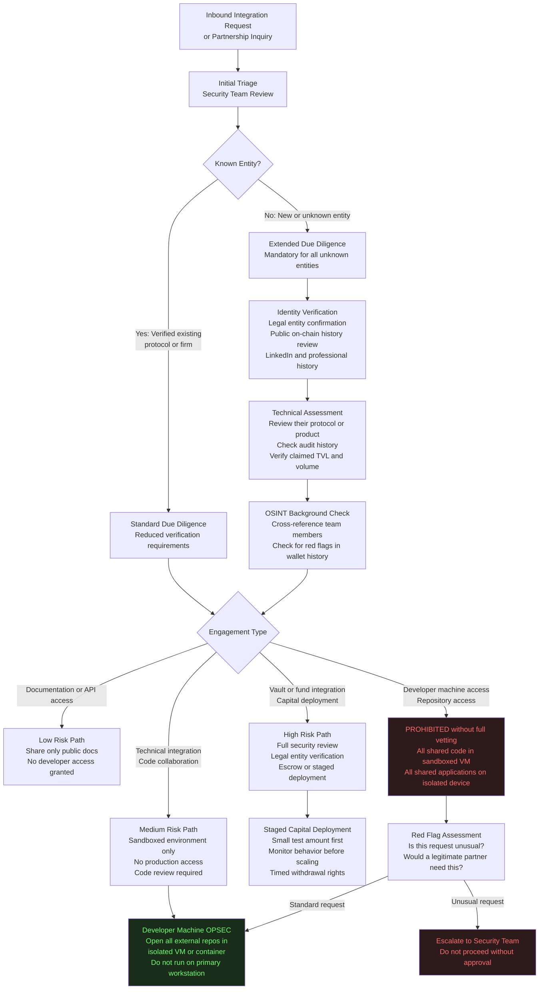

# DApp Security

**Path:** `github.com/safeedges/infrasecurity/dapp-security/`  
**Document Version:** 1.6  
**Classification:** Public Reference Architecture  
**Domain Coverage:** Frontend Security, Wallet Integration, Transaction Security, OPSEC for Protocol Teams  

---

## Threat Model

The DApp frontend layer is frequently treated as a cosmetic layer over smart contracts, but it is a primary attack surface with direct user-facing consequences. Relevant threats:

1. Frontend hijack via compromised CDN, DNS, or hosting provider, replacing legitimate DApp with a drainer UI
2. Malicious RPC provider injection that manipulates transaction data between the DApp and the user's wallet
3. Supply chain attacks via compromised npm packages (the Web3 ecosystem has extensive supply chain exposure)
4. Social engineering attacks targeting developers to introduce backdoors in frontend build pipelines
5. Transaction simulation manipulation: showing users a benign simulation while the actual transaction does something different
6. Wallet drain approvals via malicious ERC-20 approve or permit2 transactions hidden in complex UI flows

---

## Frontend Security Architecture

### Content Security and Integrity Verification

```html
<!--
  index.html
  
  Demonstrates security headers and Subresource Integrity (SRI) configuration
  for a secure DApp frontend.
  
  SRI ensures that even if an attacker compromises a CDN and replaces
  a JavaScript file, the browser will refuse to execute the modified
  file because its hash no longer matches the expected value.
  
  Generate SRI hashes: openssl dgst -sha384 -binary filename.js | openssl base64 -A
  Or use: https://www.srihash.org
-->
<!DOCTYPE html>
<html lang="en">
<head>
  <meta charset="UTF-8">
  
  <!--
    Content Security Policy (CSP)
    
    This policy restricts where scripts, styles, and other resources can
    be loaded from. An attacker who hijacks a CDN cannot inject resources
    from their own domain because the CSP will block them.
    
    Critically: no eval, no inline scripts, no unsafe sources.
    Each script source must be explicitly listed.
  -->
  <meta http-equiv="Content-Security-Policy" content="
    default-src 'none';
    script-src 'self' 'sha384-REPLACE_WITH_ACTUAL_HASH';
    style-src 'self' 'sha384-REPLACE_WITH_ACTUAL_HASH';
    connect-src 'self' https://api.your-rpc-provider.com wss://ws.your-rpc-provider.com;
    img-src 'self' data:;
    font-src 'self';
    form-action 'none';
    base-uri 'self';
    frame-ancestors 'none';
    upgrade-insecure-requests;
  ">
  
  <!-- Prevent clickjacking -->
  <meta http-equiv="X-Frame-Options" content="DENY">
  
  <!-- Prevent MIME type sniffing -->
  <meta http-equiv="X-Content-Type-Options" content="nosniff">
  
  <!-- Strict referrer policy: no referrer on cross-origin requests -->
  <meta name="referrer" content="no-referrer">
  
  <!--
    Subresource Integrity for all third-party scripts.
    Replace the hash with the actual SHA-384 hash of the file.
    
    ethers.js example - always verify the current hash from the official source
  -->
  <script 
    src="https://cdnjs.cloudflare.com/ajax/libs/ethers/6.x.x/ethers.umd.min.js"
    integrity="sha384-REPLACE_WITH_ACTUAL_CURRENT_HASH"
    crossorigin="anonymous"
  ></script>
  
  <title>Protocol Interface</title>
</head>
<body>
  <!-- Application content -->
</body>
</html>
```

### Transaction Construction and Display

One of the most effective attack patterns against DApp users is to display a benign-looking transaction in the UI while the actual transaction includes additional malicious calls (token approvals, delegate calls, or poison ERC-20 transfers). The following pattern demonstrates how to construct and display transactions in a way that gives users full visibility.

```typescript
/**
 * transactionBuilder.ts
 *
 * Secure transaction construction with:
 * 1. Explicit function selector display
 * 2. Decoded parameter display before signing
 * 3. Token approval scope verification
 * 4. Simulation-before-sign requirement
 * 5. ERC-20 approval amount cap enforcement
 */

import { ethers, Contract, Signer } from "ethers";

interface TransactionReview {
    functionName: string;
    parameters: Record<string, string>;
    estimatedGas: bigint;
    simulationSuccess: boolean;
    simulationOutput: string;
    tokenApprovals: TokenApproval[];
    warnings: string[];
}

interface TokenApproval {
    tokenAddress: string;
    tokenSymbol: string;
    spenderAddress: string;
    approvalAmount: bigint;
    isUnlimited: boolean;
}

class SecureTransactionBuilder {
    
    private provider: ethers.Provider;
    private simulationEndpoint: string;
    
    // Maximum single transaction value that can be processed without
    // requiring explicit user confirmation of simulation results
    private static MAX_AUTO_VALUE_USD = 1000;
    
    constructor(provider: ethers.Provider, simulationEndpoint: string) {
        this.provider = provider;
        this.simulationEndpoint = simulationEndpoint;
    }
    
    /**
     * prepareAndVerifyTransaction
     *
     * Before presenting a transaction to the user for signing:
     * 1. Decode all function calls and parameters
     * 2. Identify any token approvals and their scope
     * 3. Simulate the transaction and report results
     * 4. Generate human-readable warnings for dangerous patterns
     *
     * Returns a TransactionReview that the UI must display to the user.
     * The transaction cannot proceed to signing until the user has
     * reviewed and confirmed the TransactionReview output.
     */
    async prepareAndVerifyTransaction(
        target: string,
        calldata: string,
        value: bigint,
        signer: Signer
    ): Promise<TransactionReview> {
        
        const warnings: string[] = [];
        const tokenApprovals: TokenApproval[] = [];
        
        // Decode the calldata
        const decoded = await this.decodeCalldata(target, calldata);
        
        // Check for unlimited token approvals (approve(spender, uint256.max))
        if (decoded.functionName === "approve") {
            const spender = decoded.parameters["spender"];
            const amount = BigInt(decoded.parameters["amount"]);
            const maxUint256 = BigInt("0xffffffffffffffffffffffffffffffffffffffffffffffffffffffffffffffff");
            
            const tokenApproval: TokenApproval = {
                tokenAddress: target,
                tokenSymbol: await this.getTokenSymbol(target),
                spenderAddress: spender,
                approvalAmount: amount,
                isUnlimited: amount === maxUint256
            };
            
            tokenApprovals.push(tokenApproval);
            
            if (tokenApproval.isUnlimited) {
                warnings.push(
                    `UNLIMITED APPROVAL: This transaction grants ${spender} the ability to spend all of your ${tokenApproval.tokenSymbol} at any future time. Consider using a specific amount instead.`
                );
            }
        }
        
        // Check for delegate calls (high-risk pattern)
        if (calldata.includes("0x5c19a95c")) { // delegatecall selector
            warnings.push(
                "DELEGATE CALL DETECTED: This transaction includes a delegatecall operation. Delegatecall executes code from another contract in the context of the calling contract. This is a high-risk operation pattern commonly used in proxy contracts but also in attacks."
            );
        }
        
        // Simulate the transaction
        const simulation = await this.simulateTransaction(
            target, calldata, value, await signer.getAddress()
        );
        
        if (!simulation.success) {
            warnings.push(
                `SIMULATION FAILED: The transaction simulation reverted with message: "${simulation.revertReason}". Proceeding with a transaction that will revert wastes gas and may indicate an attack.`
            );
        }
        
        // Estimate gas
        const estimatedGas = await this.provider.estimateGas({
            to: target,
            data: calldata,
            value: value,
            from: await signer.getAddress()
        });
        
        return {
            functionName: decoded.functionName,
            parameters: decoded.parameters,
            estimatedGas,
            simulationSuccess: simulation.success,
            simulationOutput: simulation.output,
            tokenApprovals,
            warnings
        };
    }
    
    private async decodeCalldata(
        target: string,
        calldata: string
    ): Promise<{ functionName: string; parameters: Record<string, string> }> {
        
        const selector = calldata.slice(0, 10);
        
        // In production: use a 4byte.directory or Etherscan API lookup
        // to resolve function selectors to human-readable signatures
        // This is a simplified example
        const knownSelectors: Record<string, string> = {
            "0xa9059cbb": "transfer(address,uint256)",
            "0x095ea7b3": "approve(address,uint256)",
            "0x23b872dd": "transferFrom(address,address,uint256)",
        };
        
        const signature = knownSelectors[selector] || `UNKNOWN_FUNCTION(${selector})`;
        
        if (!knownSelectors[selector]) {
            return {
                functionName: signature,
                parameters: { rawCalldata: calldata }
            };
        }
        
        const iface = new ethers.Interface([`function ${signature}`]);
        const decoded = iface.parseTransaction({ data: calldata });
        
        const parameters: Record<string, string> = {};
        decoded?.fragment.inputs.forEach((input, index) => {
            parameters[input.name] = decoded.args[index].toString();
        });
        
        return { functionName: decoded?.name || signature, parameters };
    }
    
    private async simulateTransaction(
        target: string,
        calldata: string,
        value: bigint,
        from: string
    ): Promise<{ success: boolean; output: string; revertReason: string }> {
        
        try {
            const result = await this.provider.call({
                to: target,
                data: calldata,
                value: value,
                from: from
            });
            
            return {
                success: true,
                output: result,
                revertReason: ""
            };
        } catch (error: unknown) {
            const err = error as { reason?: string; message?: string };
            return {
                success: false,
                output: "",
                revertReason: err.reason || err.message || "Unknown revert reason"
            };
        }
    }
    
    private async getTokenSymbol(tokenAddress: string): Promise<string> {
        try {
            const contract = new Contract(
                tokenAddress,
                ["function symbol() view returns (string)"],
                this.provider
            );
            return await contract.symbol();
        } catch {
            return "UNKNOWN";
        }
    }
}
```

---

## OPSEC for Protocol Teams

The Drift Protocol attack succeeded in large part because the protocol team had no formal OPSEC policy governing external engagement. The following section provides a framework that would have materially reduced the attack surface.

### External Engagement Security Flow



### Developer Machine OPSEC: External Code Policy

```bash
#!/bin/bash
#
# external-code-sandbox.sh
#
# Creates an isolated Docker container for evaluating external code.
# This implements the sandbox that should be used any time a developer
# opens code provided by an external party.
#
# The Drift attack vector:
# - Attacker shared a GitHub repository claiming to be a frontend tool
# - Developer cloned and opened the repository on their primary workstation
# - A VSCode/Cursor vulnerability executed malicious code silently on open
#
# This script would have contained that attack to the sandbox container.

set -euo pipefail

CONTAINER_NAME="external-code-sandbox-$(date +%Y%m%d-%H%M%S)"
EXTERNAL_REPO_URL="${1:-}"
WORK_DIR="/tmp/sandbox-work"

if [ -z "$EXTERNAL_REPO_URL" ]; then
    echo "Usage: $0 <external-repository-url>"
    echo "Example: $0 https://github.com/external-party/their-tool"
    exit 1
fi

echo "=== External Code Sandbox ==="
echo "Repository: $EXTERNAL_REPO_URL"
echo "Container: $CONTAINER_NAME"
echo ""
echo "WARNING: This container is isolated but the code inside it is untrusted."
echo "Do not mount your home directory or any sensitive paths into this container."
echo ""

# Create Dockerfile for isolated evaluation environment
cat > /tmp/sandbox.Dockerfile << 'DOCKERFILE'
FROM ubuntu:24.04

RUN apt-get update -q && \
    apt-get install -y -q \
        git \
        curl \
        nodejs \
        npm \
        python3 \
        python3-pip \
        vim \
        less && \
    apt-get clean && \
    rm -rf /var/lib/apt/lists/*

# Create an unprivileged user
RUN useradd -m -s /bin/bash sandboxuser

# Switch to unprivileged user
USER sandboxuser
WORKDIR /home/sandboxuser

# Set restrictive PATH that does not include system binaries the code
# should not need
ENV PATH="/home/sandboxuser/.local/bin:/usr/local/sbin:/usr/local/bin:/usr/sbin:/usr/bin:/sbin:/bin"

DOCKERFILE

# Build the sandbox image
docker build -t safeedges-sandbox:latest -f /tmp/sandbox.Dockerfile /tmp/

# Run the container with extensive restrictions:
# --no-new-privileges: process cannot escalate privileges
# --memory: limit memory usage
# --cpus: limit CPU usage
# --read-only: filesystem is read-only except for explicit writable mounts
# --tmpfs: provide writable temporary storage
# --network=none: NO network access
docker run \
    --name "$CONTAINER_NAME" \
    --no-new-privileges \
    --memory="2g" \
    --cpus="1.0" \
    --read-only \
    --tmpfs /home/sandboxuser/work:rw,noexec,nosuid,size=1g \
    --tmpfs /tmp:rw,noexec,nosuid,size=512m \
    --network=none \
    --security-opt seccomp=/path/to/custom-seccomp-profile.json \
    --user sandboxuser \
    -it \
    safeedges-sandbox:latest \
    /bin/bash -c "
        cd /home/sandboxuser/work && \
        echo 'SANDBOX: Cloning repository (network was available at clone time)' && \
        git clone --depth=1 '$EXTERNAL_REPO_URL' repo && \
        echo 'SANDBOX: Repository cloned. Network is now disabled.' && \
        echo 'SANDBOX: Review the code manually before executing any part of it.' && \
        echo 'SANDBOX: The container has no network access.' && \
        bash
    "

echo ""
echo "Container $CONTAINER_NAME exited."
echo "To remove the container: docker rm $CONTAINER_NAME"
```

---

## RPC Security

The KelpDAO attack exploited the fact that LayerZero's DVN infrastructure relied on RPC endpoints that could be simultaneously compromised and suppressed. Application-level RPC security is a separate concern from the DVN infrastructure discussed in protocol-security, applying to any DApp or tool that queries blockchain state.

### Secure Multi-Provider RPC Client

```typescript
/**
 * secureRpcClient.ts
 *
 * Multi-provider RPC client that:
 * 1. Queries multiple independent RPC providers simultaneously
 * 2. Requires majority consensus before accepting a result
 * 3. Detects and quarantines providers that return outlier data
 * 4. Alerts when provider consensus cannot be established
 *
 * This pattern, applied to the LayerZero DVN infrastructure,
 * would have detected the poisoned RPC responses in the KelpDAO attack
 * and refused to sign the fabricated cross-chain message.
 */

import { ethers } from "ethers";

interface ProviderHealth {
    endpoint: string;
    isHealthy: boolean;
    consecutiveFailures: number;
    lastSuccessTimestamp: number;
    responseTimeMs: number;
}

interface ConsensusResult<T> {
    value: T;
    consensusReached: boolean;
    participatingProviders: string[];
    disagreingProviders: string[];
    consensusRatio: number;
}

class SecureMultiProviderClient {
    
    private providers: ethers.JsonRpcProvider[];
    private providerHealth: Map<string, ProviderHealth>;
    private endpoints: string[];
    
    // Minimum fraction of providers that must agree on a result
    private consensusThreshold = 0.67; // Two-thirds majority
    
    // Maximum block number difference before a provider is considered stale
    private maxBlockLag = 3;
    
    constructor(rpcEndpoints: string[]) {
        if (rpcEndpoints.length < 3) {
            throw new Error(
                "Minimum 3 independent RPC providers required for consensus operation. " +
                "Fewer providers allow a single compromised provider to achieve majority."
            );
        }
        
        this.endpoints = rpcEndpoints;
        this.providers = rpcEndpoints.map(e => new ethers.JsonRpcProvider(e));
        this.providerHealth = new Map(
            rpcEndpoints.map(e => [e, {
                endpoint: e,
                isHealthy: true,
                consecutiveFailures: 0,
                lastSuccessTimestamp: Date.now(),
                responseTimeMs: 0
            }])
        );
    }
    
    /**
     * getConsensusBlockNumber
     *
     * Returns the current block number only if a majority of providers agree.
     * Stale providers (lagging by maxBlockLag blocks) are excluded.
     */
    async getConsensusBlockNumber(): Promise<ConsensusResult<number>> {
        const results = await this.queryAllProviders(
            async (provider) => await provider.getBlockNumber()
        );
        
        return this.findConsensus(results, (a, b) => Math.abs(a - b) <= this.maxBlockLag);
    }
    
    /**
     * getConsensusBalance
     *
     * Returns an account balance only if a majority of providers agree.
     * Used for verification before any bridge operation.
     */
    async getConsensusBalance(address: string): Promise<ConsensusResult<bigint>> {
        const results = await this.queryAllProviders(
            async (provider) => await provider.getBalance(address)
        );
        
        // Allow 0.01% variance for in-flight transactions
        return this.findConsensus(results, (a, b) => {
            const delta = a > b ? a - b : b - a;
            const maxDelta = (a > b ? a : b) / BigInt(10000); // 0.01%
            return delta <= maxDelta;
        });
    }
    
    /**
     * getConsensusLogs
     *
     * Retrieves event logs only when a majority of providers return the same logs.
     * Critical for bridge operations: verifying that a burn/lock event occurred.
     *
     * In the KelpDAO attack, the poisoned RPC nodes returned fabricated burn events.
     * This function would have detected the fabrication because the honest majority
     * of providers would not have returned the same fabricated log.
     */
    async getConsensusLogs(filter: ethers.Filter): Promise<ConsensusResult<ethers.Log[]>> {
        const results = await this.queryAllProviders(
            async (provider) => await provider.getLogs(filter)
        );
        
        // For logs, consensus means identical log count and transaction hashes
        return this.findConsensus(results, (a, b) => {
            if (a.length !== b.length) return false;
            return a.every((log, i) => log.transactionHash === b[i]?.transactionHash);
        });
    }
    
    private async queryAllProviders<T>(
        query: (provider: ethers.JsonRpcProvider) => Promise<T>
    ): Promise<Array<{ endpoint: string; value: T | null; error: Error | null; latencyMs: number }>> {
        
        const healthyProviders = this.providers.filter((_, i) => {
            const health = this.providerHealth.get(this.endpoints[i]);
            return health?.isHealthy ?? false;
        });
        
        const queries = this.providers.map(async (provider, i) => {
            const start = Date.now();
            try {
                const value = await Promise.race([
                    query(provider),
                    new Promise<never>((_, reject) => 
                        setTimeout(() => reject(new Error("Timeout")), 5000)
                    )
                ]);
                
                const latencyMs = Date.now() - start;
                this.updateProviderHealth(this.endpoints[i], true, latencyMs);
                
                return { endpoint: this.endpoints[i], value, error: null, latencyMs };
            } catch (err) {
                this.updateProviderHealth(this.endpoints[i], false, 0);
                return {
                    endpoint: this.endpoints[i],
                    value: null,
                    error: err as Error,
                    latencyMs: Date.now() - start
                };
            }
        });
        
        return Promise.all(queries);
    }
    
    private findConsensus<T>(
        results: Array<{ endpoint: string; value: T | null; error: Error | null }>,
        equalityFn: (a: T, b: T) => boolean
    ): ConsensusResult<T> {
        
        const successful = results.filter(r => r.value !== null && r.error === null);
        
        if (successful.length === 0) {
            throw new Error("All RPC providers failed or timed out. Cannot establish consensus.");
        }
        
        // Find the result with the most agreement
        let bestResult: T = successful[0].value as T;
        let bestCount = 0;
        
        for (const candidate of successful) {
            const agreeing = successful.filter(r => 
                equalityFn(r.value as T, candidate.value as T)
            );
            
            if (agreeing.length > bestCount) {
                bestCount = agreeing.length;
                bestResult = candidate.value as T;
            }
        }
        
        const consensusRatio = bestCount / successful.length;
        const consensusReached = consensusRatio >= this.consensusThreshold;
        
        const participatingProviders = successful
            .filter(r => equalityFn(r.value as T, bestResult))
            .map(r => r.endpoint);
        
        const disagreingProviders = successful
            .filter(r => !equalityFn(r.value as T, bestResult))
            .map(r => r.endpoint);
        
        if (!consensusReached) {
            console.error(
                `Consensus NOT reached. Only ${Math.round(consensusRatio * 100)}% of providers agree. ` +
                `Required: ${Math.round(this.consensusThreshold * 100)}%. ` +
                `Disagreeing: ${disagreingProviders.join(", ")}`
            );
        }
        
        if (disagreingProviders.length > 0) {
            console.warn(
                `Provider disagreement detected. Possible compromise or sync issue. ` +
                `Disagreeing providers: ${disagreingProviders.join(", ")}`
            );
        }
        
        return {
            value: bestResult,
            consensusReached,
            participatingProviders,
            disagreingProviders,
            consensusRatio
        };
    }
    
    private updateProviderHealth(
        endpoint: string,
        success: boolean,
        latencyMs: number
    ): void {
        const health = this.providerHealth.get(endpoint);
        if (!health) return;
        
        if (success) {
            health.consecutiveFailures = 0;
            health.isHealthy = true;
            health.lastSuccessTimestamp = Date.now();
            health.responseTimeMs = latencyMs;
        } else {
            health.consecutiveFailures++;
            if (health.consecutiveFailures >= 3) {
                health.isHealthy = false;
                console.error(`Provider ${endpoint} marked unhealthy after ${health.consecutiveFailures} consecutive failures`);
            }
        }
    }
}
```

---

## DApp Security Checklist

**Frontend Integrity**  
1. Content Security Policy headers are deployed and cover all resource types  
2. Subresource Integrity hashes are set for all third-party script dependencies  
3. Frontend is served over HTTPS with HSTS enabled  
4. DNS records use DNSSEC  
5. Frontend build pipeline is reproducible and auditable  

**Transaction Security**  
6. All transactions are decoded and displayed in human-readable form before signing  
7. Token approval amounts are displayed prominently with an unlimited approval warning  
8. Transactions are simulated before presenting the signing request to the user  
9. Transaction simulation failures block proceeding to signature  
10. Contract addresses displayed to users are verified checksummed addresses  

**Wallet Integration**  
11. WalletConnect sessions use per-request approval, not blanket session permissions  
12. Signature requests display the full decoded message content  
13. eth_sign is blocked in favor of EIP-712 typed structured data signing  
14. Domain binding in EIP-712 signatures includes the correct chain ID and verifying contract  

**OPSEC and Team Security**  
15. External integration requests go through a formal vetting process  
16. All external code is reviewed in isolated sandbox environments before opening on primary machines  
17. Developers on signing key machines have no external code access  
18. Social engineering awareness training is conducted quarterly  
19. All team communication platforms require hardware-key-backed MFA  
20. External application downloads (TestFlight, APK sideloading) are prohibited on devices with production access  
