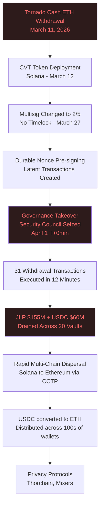
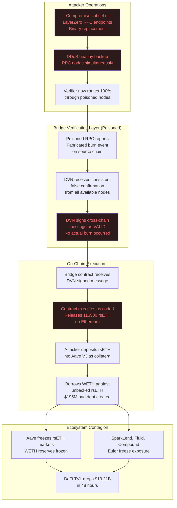

# Incident Analysis: State-Sponsored Web3 Infrastructure Attacks (2026)

**Path:** `github.com/safeedges/infrasecurity/incident-analysis/`  
**Document Version:** 1.4  
**Classification:** Public Research  
**Contributors:** SafeEdges Threat Intelligence Unit  

---

## Executive Summary

In the first 21 days of April 2026, two state-sponsored cyberattacks against Web3 protocols resulted in confirmed losses exceeding $578 million. Both incidents are attributed with medium-to-high confidence to DPRK-affiliated threat actors. The attacks targeted fundamentally different layers of the Web3 stack, demonstrating that Lazarus Group has developed parallel capability streams: one targeting governance and key management (Drift), and one targeting cross-chain infrastructure trust assumptions (KelpDAO). This document provides a full technical reconstruction of both incidents, extracts the relevant TTPs, and maps them to the MITRE ATT&CK for Enterprise and the emerging ATT&CK for Web3 framework.

---

## Incident 1: Drift Protocol — April 1, 2026

### Overview

| Field               | Value                                                        |
|---------------------|--------------------------------------------------------------|
| Protocol            | Drift Protocol (Solana-based perpetual futures DEX)         |
| Exploit Date        | April 1, 2026                                               |
| Total Value Lost    | $286 million (Elliptic, TRM Labs confirmed)                 |
| TVL Before Attack   | approximately $550 million                                  |
| TVL After Attack    | approximately $250 million                                  |
| Execution Duration  | 12 minutes                                                  |
| Attribution         | DPRK UNC4736 / AppleJeus / Lazarus Group                    |
| Preparation Period  | Approximately 6 months (October 2025 to March 2026)         |

### Attack Timeline

**October 2025 — Initial Contact**

A group of individuals posing as representatives of a quantitative trading firm approached Drift contributors at a major crypto industry conference. They presented verified professional backgrounds, demonstrated technical fluency in DeFi architecture, and expressed interest in a vault integration. This initial contact was entirely consistent with a legitimate business inquiry and raised no red flags.

**November 2025 to January 2026 — Trust Building Phase**

The group continued contact with Drift contributors across multiple international industry events. They held working sessions, asked detailed product and governance questions, and submitted integration documentation that appeared technically sound. During December 2025 and January 2026, they onboarded an ecosystem vault, submitted strategy parameters, and deposited over $1 million of real capital into the protocol. This deposit served two purposes: it made the group appear financially credible, and it gave them live access to test protocol mechanics from the inside.

**February to March 2026 — Malware Delivery and Access Establishment**

As collaboration deepened, the group shared technical resources with Drift contributors. At least one contributor cloned a GitHub repository presented as a frontend deployment tool. At least one other contributor installed a TestFlight application described as a wallet product. Both delivery vectors exploited a known vulnerability in VSCode and Cursor IDEs that was active during December 2025 through February 2026, which allowed silent code execution upon opening certain file types without user confirmation or warning dialog. Once installed, the malware provided persistent access to developer machines and potentially access to signing keys or seed material stored in software wallets or browser extensions.

**March 11, 2026 — Pre-positioning Begins**

The attacker withdrew ETH from Tornado Cash on Ethereum. This is the standard Lazarus laundering entry vector used to obscure the origin of operational funds. On March 12, the attacker deployed the CVT (carbonvote token) contract on Solana, a synthetic token with no intrinsic value that would later be used as fake collateral.

**March 27, 2026 — Governance Alteration**

The protocol's multisig configuration was changed to a 2-of-5 setup without a timelock. Security researchers later identified this governance change as the pivotal enabling action. Without a timelock, any multisig decision could be executed immediately with no observation window. The previous configuration had included a delay mechanism that would have given the community time to identify and challenge malicious governance actions.

**March 2026 — Durable Nonce Pre-signing**

Solana's durable nonce feature allows transactions to be signed in advance and remain valid indefinitely, unlike standard Solana transactions which expire after approximately 150 blocks. The attackers used compromised developer access to pre-sign a series of governance and withdrawal transactions. These transactions were cryptographically valid and could be submitted to the network at any future time, turning them into latent exploit payloads.

**April 1, 2026 — Execution**

At 08:00 UTC approximate, the attacker submitted the pre-signed transactions and seized administrative control of Drift's Security Council. With Security Council control, they executed 31 rapid withdrawal transactions across approximately 20 vaults, draining primarily JLP tokens ($155 million) and USDC ($60 million) within 12 minutes. The protocol detected the attack and suspended deposits and withdrawals, but the drain had already completed.

### Technical Attack Flow

### Root Cause Analysis

The attack succeeded through the combination of four distinct failures, none of which would have been sufficient alone:

**Failure 1 — Social Engineering Resilience**  
The protocol had no formal policy governing external engagements, no OPSEC training for contributors, and no procedure for vetting new integration partners before granting them access to developer resources such as shared repositories and applications.

**Failure 2 — Developer Machine Security**  
Contributor machines were compromised through standard tooling (VSCode, TestFlight). There was no air-gapping of developer environments from signing environments, no requirement for cold hardware wallets exclusively for signing, and no monitoring for anomalous process execution on developer machines.

**Failure 3 — Governance Timelock Removal**  
The removal of the timelock from the multisig on March 27 converted a difficult-to-exploit system (an attacker would need to wait through the delay, during which the community could observe and challenge the transaction) into a trivially exploitable one (any multisig action executes immediately). This change was implemented without a formal security review or community notification.

**Failure 4 — Durable Nonce Awareness**  
The protocol had no monitoring for durable nonce account creation or pre-signed transaction staging. These latent exploit payloads sat on-chain, fully visible, for days before execution. An automated alert system monitoring for durable nonce accounts controlled by addresses not registered to the protocol would have flagged the attack in the preparation phase.

---

## Incident 2: KelpDAO rsETH Bridge — April 18, 2026

### Overview

| Field               | Value                                                        |
|---------------------|--------------------------------------------------------------|
| Protocol            | KelpDAO / KernelDAO (Ethereum liquid restaking, rsETH)      |
| Exploit Date        | April 18, 2026                                              |
| Total Value Lost    | $292 to $294 million (Chainalysis, Cyvers confirmed)        |
| rsETH Stolen        | 116,500 rsETH                                               |
| Execution Duration  | Approximately 46 minutes before pause                       |
| Attribution         | DPRK Lazarus Group / TraderTraitor unit                     |
| Infrastructure      | LayerZero cross-chain bridge, DVN (Decentralized Verifier Network) |

### The Cross-Chain Bridge Trust Model

To understand this attack, one must first understand how LayerZero bridges work. LayerZero enables cross-chain asset movement by relying on a Decentralized Verifier Network (DVN) to confirm that events on one chain (such as a token burn) actually occurred before releasing corresponding tokens on the destination chain. The security of this model is entirely dependent on the trustworthiness of the DVN.

KelpDAO's rsETH bridge was configured with a 1-of-1 DVN setup, meaning a single verifier was responsible for confirming cross-chain events. This created a single point of failure: if that one verifier could be made to report false information, the bridge would release tokens on the destination chain without any corresponding legitimate action on the source chain.

LayerZero has stated it recommended multi-DVN configurations. KelpDAO has stated that LayerZero's default deployment code and documentation promoted single-source verification, and that their configuration choices followed LayerZero's guidance. Independent review of LayerZero's public deployment repositories by multiple security researchers, including Yearn Finance developer Artem K (@banteg), appeared to support KelpDAO's framing. The attribution of the configuration decision remains disputed.

### Attack Mechanics

**RPC Endpoint Compromise**

LayerZero's DVN infrastructure relies on RPC (Remote Procedure Call) endpoints to query blockchain state and verify transactions. The attacker compromised a subset of these RPC endpoints by overwriting their binaries with malicious applications. These poisoned nodes fed false transaction data to the verifier while continuing to report accurate data through all other interfaces, making the compromise invisible to standard health monitoring.

**DDoS of Healthy Nodes**

To ensure the verifier was forced to rely exclusively on the compromised nodes, the attacker simultaneously launched a Distributed Denial of Service attack against the healthy RPC endpoints. With the backup nodes overwhelmed, the verifier's only functioning data source was the attacker-controlled poisoned infrastructure.

**Fabricated Burn Event**

The poisoned RPC nodes reported to the DVN that a legitimate rsETH burn event had occurred on the source chain. No such burn occurred. But with the DVN receiving consistent false confirmation from all available (poisoned) endpoints, it signed off on the cross-chain message as valid.

**Destination Chain Release**

With the DVN's signature in place, the bridge contract on Ethereum behaved exactly as designed: it released 116,500 rsETH in response to the confirmed burn message. The smart contracts executed correctly per their code. The failure was entirely at the trust and infrastructure layer, not the contract layer.

**Secondary Exploitation (Aave Collateral Attack)**

The attacker then deposited the stolen rsETH into Aave V3 as collateral to borrow WETH. Because the stolen rsETH had no legitimate backing, the resulting loans were entirely unbacked. This created approximately $195 million in bad debt on Aave, forced Aave to freeze rsETH markets, freeze WETH reserves across Ethereum, Arbitrum, Base, Mantle, and Linea, and ultimately caused Aave's TVL to drop from $26.4 billion to $18.6 billion within 48 hours.

### Attack Infrastructure Diagram

### Root Cause Analysis

**Failure 1 — Single DVN Configuration (1-of-1)**  
A 1-of-1 verifier setup means the bridge has zero fault tolerance for verifier compromise. A properly configured multi-DVN setup would require N-of-M independent verifiers to agree before any cross-chain message is accepted. Compromising one verifier in a 2-of-3 setup is insufficient to forge a message. Regardless of who was responsible for this configuration decision, the architectural outcome was a single point of failure on the most critical trust component of the bridge.

**Failure 2 — RPC Node Diversity**  
The DVN infrastructure relied on a set of RPC endpoints that could be simultaneously compromised and DDoS'd. A properly hardened RPC setup would have included diverse providers across different hosting environments, geographic locations, and organizational control. No single adversary should be able to simultaneously compromise and suppress all available endpoint sources.

**Failure 3 — Absence of Cross-Chain State Consistency Monitoring**  
The attack was only detectable in real time if someone was monitoring the total circulating supply of rsETH on all chains against the total locked collateral on the source chain. A system that continuously verifies that (total rsETH in circulation across all chains) equals (total ETH locked in deposit contracts) would have raised an alert the moment unbacked rsETH was minted. No such system was in place. Chainalysis specifically identified this gap: "Protocols must detect when a system enters an impossible state."

**Failure 4 — Emergency Pause Latency**  
The protocol paused 46 minutes after the initial drain. During that window, the attacker attempted at least two follow-up operations that would have released an additional $200 million. The existing emergency pause mechanism worked when triggered, but the trigger latency was too high for an attack that moved this fast. Automated circuit breakers would have reduced this window from 46 minutes to seconds.

---

## Comparative TTP Analysis

The following table maps observed TTPs from both incidents to MITRE ATT&CK categories.

| TTP                                   | Drift   | KelpDAO | ATT&CK Category                    |
|---------------------------------------|---------|---------|-------------------------------------|
| Long-cycle social engineering         | Yes     | Partial | T1566 Phishing (Spearphishing)     |
| Malicious code via trusted repository | Yes     | No      | T1195 Supply Chain Compromise      |
| IDE vulnerability exploitation        | Yes     | No      | T1203 Exploitation for Client Execution |
| RPC infrastructure compromise         | No      | Yes     | T1565 Data Manipulation            |
| DDoS of legitimate infrastructure     | No      | Yes     | T1499 Endpoint Denial of Service   |
| Governance mechanism abuse            | Yes     | No      | T1548 Abuse Elevation Control      |
| Pre-signed latent transactions        | Yes     | No      | Novel / Blockchain-specific        |
| Fabricated oracle / verifier state    | No      | Yes     | T1565.001 Stored Data Manipulation |
| Cross-protocol contagion              | Partial | Yes     | T1499 / T1485                      |
| Rapid multi-chain laundering          | Yes     | Yes     | T1020 Automated Exfiltration       |

---

## Key Lessons for Protocol Teams

**Lesson 1:** Code audits do not protect against infrastructure attacks.  
Both Drift and KelpDAO had undergone recent security audits that returned clean results. The smart contracts in both cases executed exactly as written. The attacks succeeded at layers the auditors were not evaluating.

**Lesson 2:** Governance is an attack surface.  
Any mechanism that can be used to alter protocol parameters or drain funds must be protected by timelocks, multi-party controls, and community-observable delays. Removing a timelock without a full security review is equivalent to removing a lock from a vault.

**Lesson 3:** Trust is exploitable over time.  
A six-month trust-building campaign is operationally feasible for a nation-state. OPSEC policies must account for long-dwell adversaries who are patient, professionally presented, and willing to invest real resources to establish credibility.

**Lesson 4:** Single points of failure in bridge verification are critical risks.  
Any bridge that can be drained by compromising a single verifier or a single set of RPC endpoints is not secure at scale. Multi-DVN configurations with diverse, independently operated verification infrastructure are a security minimum, not an optimization.

**Lesson 5:** DeFi interconnectedness creates systemic risk.  
The use of stolen rsETH as Aave collateral demonstrates that a single bridge exploit can create bad debt across the entire DeFi lending stack. Protocols accepting cross-chain tokens as collateral must implement independent supply audits and circuit breakers for unusual minting events.
