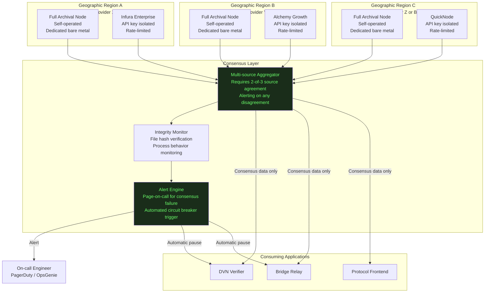
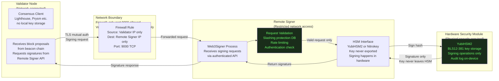

# Infrastructure Security: RPC Nodes, Validators, and Network Architecture

**Path:** `github.com/safeedges/infrasecurity/infrastructure-security/`  
**Document Version:** 1.5  
**Classification:** Public Reference Architecture  
**Domain Coverage:** RPC Node Security, Validator Infrastructure, Network Segmentation, Monitoring  

---

## Threat Model

The KelpDAO incident established that production blockchain infrastructure is a target for nation-state actors willing to invest significant resources to compromise specific servers. The threat model for infrastructure operators must assume:

1. Advanced persistent threat actors with the capability to target and compromise specific servers via supply chain, social engineering, or vulnerability exploitation
2. Simultaneous targeted DDoS against backup and monitoring infrastructure to force reliance on compromised components
3. Binary replacement attacks: replacing legitimate node binaries with malicious versions that selectively report false data while appearing healthy through standard monitoring channels
4. Long-dwell compromise: an attacker may have read access to infrastructure for months before taking active action

---

## RPC Node Architecture

### Hardened Multi-Provider Setup

The following architecture diagram represents the minimum viable RPC infrastructure for any bridge or protocol that relies on RPC data for security decisions.



### Node Binary Integrity Verification

The KelpDAO attack involved replacing legitimate node binaries with malicious versions. The following service continuously verifies the integrity of all node binaries and triggers an alert if any binary changes without an authorized update event.

```bash
#!/bin/bash
#
# node-integrity-monitor.sh
#
# Version: 1.2
# Purpose: Continuous monitoring of critical node binaries for unauthorized modification.
#          Runs as a systemd service with a 60-second check interval.
#
# Background: In the KelpDAO attack, attackers replaced RPC node binaries
# with versions that selectively reported false transaction data.
# This monitor would have detected that replacement within 60 seconds
# of it occurring.
#
# How it works:
# 1. On first run, compute SHA-256 hashes of all monitored binaries
# 2. Store hashes in a protected, append-only hash database
# 3. On every subsequent run, recompute and compare
# 4. If any hash changes without a recorded authorized update,
#    immediately alert and optionally stop the compromised process

set -euo pipefail

HASH_DB="/var/lib/node-integrity/hashes.db"
HASH_DB_DIR="$(dirname $HASH_DB)"
LOG_FILE="/var/log/node-integrity-monitor.log"
ALERT_WEBHOOK="${INTEGRITY_ALERT_WEBHOOK:-}"

# List of binaries to monitor
# Add all node, relayer, and verifier binaries here
MONITORED_BINARIES=(
    "/usr/local/bin/geth"
    "/usr/local/bin/lighthouse"
    "/usr/local/bin/prysm"
    "/opt/layerzero/dvn-verifier"
    "/opt/layerzero/relayer"
    "/usr/local/bin/node"
    "/usr/local/bin/python3"
)

mkdir -p "$HASH_DB_DIR"
touch "$LOG_FILE"

log() {
    echo "[$(date -Iseconds)] $1" | tee -a "$LOG_FILE"
}

alert() {
    local severity="$1"
    local message="$2"
    
    log "ALERT [$severity]: $message"
    
    # Send to webhook (PagerDuty, Slack, OpsGenie etc.)
    if [ -n "$ALERT_WEBHOOK" ]; then
        curl -s -X POST "$ALERT_WEBHOOK" \
            -H "Content-Type: application/json" \
            -d "{\"severity\": \"$severity\", \"host\": \"$(hostname)\", \"message\": \"$message\", \"timestamp\": \"$(date -Iseconds)\"}" \
            || log "WARNING: Failed to send alert to webhook"
    fi
    
    # Write to syslog for SIEM integration
    logger -p security.crit -t node-integrity "[$severity] $message"
}

compute_hash() {
    local file="$1"
    if [ -f "$file" ]; then
        sha256sum "$file" | awk '{print $1}'
    else
        echo "FILE_NOT_FOUND"
    fi
}

initialize_database() {
    log "Initializing binary hash database"
    log "This must be run on a verified clean system"
    
    > "$HASH_DB"
    
    for binary in "${MONITORED_BINARIES[@]}"; do
        if [ -f "$binary" ]; then
            hash=$(compute_hash "$binary")
            echo "$binary:$hash" >> "$HASH_DB"
            log "Recorded hash for $binary: $hash"
        else
            log "WARNING: Monitored binary not found: $binary"
        fi
    done
    
    log "Database initialized with $(wc -l < "$HASH_DB") entries"
    
    # Make the hash database immutable after initialization
    # This prevents an attacker with root access from updating the database
    # to match their modified binaries
    # Note: requires chattr support on the filesystem
    chattr +i "$HASH_DB" 2>/dev/null || log "WARNING: Could not make hash DB immutable (chattr not available)"
}

verify_binaries() {
    local violations_found=0
    
    while IFS=':' read -r binary expected_hash; do
        current_hash=$(compute_hash "$binary")
        
        if [ "$current_hash" = "FILE_NOT_FOUND" ]; then
            alert "CRITICAL" "Monitored binary MISSING: $binary"
            violations_found=$((violations_found + 1))
        elif [ "$current_hash" != "$expected_hash" ]; then
            alert "CRITICAL" "Binary modification detected: $binary | Expected: $expected_hash | Found: $current_hash"
            violations_found=$((violations_found + 1))
            
            # Optional: stop the modified process immediately
            # Adjust the process name to match your binary
            binary_name=$(basename "$binary")
            if pgrep -x "$binary_name" > /dev/null 2>&1; then
                log "Attempting to stop potentially compromised process: $binary_name"
                # pkill -x "$binary_name" || log "WARNING: Failed to stop $binary_name"
                # Uncomment the line above to enable automatic process termination
                # WARNING: This will cause service outage. Only enable if you have
                # automatic failover configured.
            fi
        fi
    done < "$HASH_DB"
    
    return $violations_found
}

# Main execution
case "${1:-verify}" in
    init)
        initialize_database
        ;;
    verify)
        if [ ! -f "$HASH_DB" ]; then
            log "Hash database not found. Run with 'init' first on a clean system."
            exit 1
        fi
        
        if verify_binaries; then
            log "All $(wc -l < "$HASH_DB") monitored binaries verified intact"
        else
            log "INTEGRITY VIOLATIONS DETECTED. See alerts above."
            exit 1
        fi
        ;;
    *)
        echo "Usage: $0 [init|verify]"
        exit 1
        ;;
esac
```

---

## Validator Infrastructure Security

Validators hold signing keys that authorize consensus signatures. A compromised validator key can lead to slashing penalties, double-voting, or in proof-of-stake systems, equivocation penalties that can destroy the staked position.

### Remote Signer Architecture

The remote signer pattern separates the validation logic (which must have network access to participate in consensus) from the key storage (which must be maximally secure). This ensures that even if the validator node is compromised, the signing keys are not accessible to the attacker.



### Web3Signer Configuration for Remote Signing

```yaml
# web3signer-config.yaml
#
# Configuration for Web3Signer remote signing service
# Deployed separately from the validator node
#
# Security properties this configuration enforces:
# 1. TLS mutual authentication: only the validator can call this API
# 2. Slashing protection: tracks all signed blocks and attestations,
#    refuses to double-sign (which would cause slashing)
# 3. HSM key storage: keys are stored in YubiHSM2, not on disk
# 4. Audit logging: all signing requests are logged

server:
  port: 9000
  host: "0.0.0.0"  # Adjust to specific interface in production

tls:
  enabled: true
  keyStore:
    type: "PKCS12"
    path: "/etc/web3signer/tls/signer.p12"
    password: "${SIGNER_TLS_KEYSTORE_PASSWORD}"
  
  # Require client certificate authentication
  # Only the validator node should have a certificate signed by this CA
  clientAuth: "REQUIRE"
  trustStore:
    type: "PKCS12"
    path: "/etc/web3signer/tls/trusted-clients.p12"
    password: "${SIGNER_TLS_TRUSTSTORE_PASSWORD}"

slashingProtection:
  enabled: true
  dbUrl: "jdbc:postgresql://localhost:5432/web3signer_slashing"
  dbUser: "web3signer"
  dbPassword: "${SLASHING_DB_PASSWORD}"
  
  # Pruning: remove old records beyond 200 epochs
  # Prevents unbounded database growth while maintaining protection
  pruningEnabled: true
  pruningEpochsToKeep: 500

metrics:
  enabled: true
  host: "127.0.0.1"  # Only expose metrics locally
  port: 9001

logging:
  level: "INFO"
  includeFormattedMsg: true

# Key configuration: YubiHSM2
# Each validator key is referenced by its public key
# The private key material never leaves the HSM
signers:
  - type: "yubihsm2"
    yubihsm2:
      connectorUrl: "http://localhost:12345"
      authKeyId: 1
      password: "${YUBIHSM_AUTH_PASSWORD}"
      opaque-data-id: 2
      # The signing key is identified by its slot in the HSM
      # Private key material is never written to this config file

# Rate limiting: reject requests exceeding normal validator throughput
# A validator signs at most once per slot (12 seconds for Ethereum)
# More than 10 signing requests per minute indicates anomalous behavior
rateLimiting:
  enabled: true
  requestsPerMinute: 10
  burstSize: 20
```

---

## Network Segmentation

Production Web3 infrastructure requires strict network segmentation. The following configuration demonstrates UFW-based segmentation for a multi-component node setup.

```bash
#!/bin/bash
#
# network-segmentation.sh
#
# Implements network segmentation for a Web3 node cluster:
# - Validator Node: can only communicate with Remote Signer and Beacon
# - Remote Signer: can only receive connections from Validator Node
# - RPC Node: can receive from allowlisted consumers, not from internet
# - Monitoring: read-only connections to all nodes
#
# Adjust IP addresses to match your actual network layout

set -euo pipefail

VALIDATOR_NODE_IP="10.0.1.10"
REMOTE_SIGNER_IP="10.0.1.20"
RPC_NODE_IP="10.0.1.30"
MONITORING_IP="10.0.1.40"
CONSUMER_IPS=("10.0.2.10" "10.0.2.11")  # DVN, bridge relay etc.

BEACON_CHAIN_PEER_PORT=9000
VALIDATOR_REMOTE_SIGNER_PORT=9000
P2P_PORT=30303
RPC_PORT=8545
WS_PORT=8546
METRICS_PORT=9090
SSH_PORT=2222

configure_validator_node() {
    local IFACE="${1:-eth0}"
    
    echo "=== Configuring Validator Node Firewall ==="
    
    ufw --force reset
    ufw default deny incoming
    ufw default allow outgoing
    
    # Allow SSH from operations subnet only
    ufw allow from 10.0.0.0/24 to any port "$SSH_PORT" proto tcp comment 'Operations SSH'
    
    # Allow beacon chain peer connections (P2P)
    ufw allow "$BEACON_CHAIN_PEER_PORT"/tcp comment 'Beacon P2P'
    ufw allow "$BEACON_CHAIN_PEER_PORT"/udp comment 'Beacon P2P discovery'
    
    # Allow metrics from monitoring only
    ufw allow from "$MONITORING_IP" to any port "$METRICS_PORT" proto tcp comment 'Prometheus metrics'
    
    # The validator node should NOT be directly accessible on RPC ports
    # It communicates with the remote signer on the internal network
    
    ufw --force enable
    echo "Validator node firewall configured"
}

configure_remote_signer() {
    echo "=== Configuring Remote Signer Firewall ==="
    
    ufw --force reset
    ufw default deny incoming
    ufw default deny outgoing  # Remote signer has NO outbound internet access
    
    # Allow SSH from operations subnet only
    ufw allow from 10.0.0.0/24 to any port "$SSH_PORT" proto tcp comment 'Operations SSH'
    
    # Allow signing requests from validator node ONLY
    ufw allow from "$VALIDATOR_NODE_IP" to any port "$VALIDATOR_REMOTE_SIGNER_PORT" proto tcp comment 'Validator signing requests'
    
    # Allow database connection to local slashing protection DB
    ufw allow out to 127.0.0.1 port 5432 proto tcp comment 'Local Postgres'
    
    # Allow metrics from monitoring only
    ufw allow from "$MONITORING_IP" to any port "$METRICS_PORT" proto tcp comment 'Prometheus metrics'
    
    ufw --force enable
    echo "Remote signer firewall configured (strict outbound deny)"
}

configure_rpc_node() {
    echo "=== Configuring RPC Node Firewall ==="
    
    ufw --force reset
    ufw default deny incoming
    ufw default allow outgoing
    
    # Allow SSH from operations subnet only
    ufw allow from 10.0.0.0/24 to any port "$SSH_PORT" proto tcp comment 'Operations SSH'
    
    # Allow P2P connections for node sync
    ufw allow "$P2P_PORT"/tcp comment 'Ethereum P2P'
    ufw allow "$P2P_PORT"/udp comment 'Ethereum P2P discovery'
    
    # Allow RPC access from approved consumers only
    # Do NOT expose RPC to internet
    for consumer_ip in "${CONSUMER_IPS[@]}"; do
        ufw allow from "$consumer_ip" to any port "$RPC_PORT" proto tcp comment "RPC consumer $consumer_ip"
        ufw allow from "$consumer_ip" to any port "$WS_PORT" proto tcp comment "WS consumer $consumer_ip"
    done
    
    # Allow metrics from monitoring only
    ufw allow from "$MONITORING_IP" to any port "$METRICS_PORT" proto tcp comment 'Prometheus metrics'
    
    ufw --force enable
    echo "RPC node firewall configured"
}

case "${1:-}" in
    validator) configure_validator_node "${2:-eth0}" ;;
    signer)    configure_remote_signer ;;
    rpc)       configure_rpc_node ;;
    *) echo "Usage: $0 [validator|signer|rpc]" ;;
esac
```

---

## Infrastructure Security Checklist

**Physical and Hosting Security**  
1. Production validator and signing infrastructure runs on dedicated hardware, not shared cloud instances  
2. Physical access to signing hardware requires two-person authorization  
3. Hardware security modules are locked to their rack and cannot be removed without visible tamper evidence  

**RPC Node Hardening**  
4. A minimum of 3 independent RPC providers from different organizations and geographic regions are deployed  
5. No single cloud provider hosts more than one required RPC source  
6. RPC endpoints are not publicly exposed; access is restricted to allowlisted consumer IPs  
7. Node binary hashes are verified at startup and on a 60-second continuous schedule  
8. Any detected binary modification triggers immediate alert and optional automatic shutdown  
9. Consensus between RPC sources is required before data is forwarded to security-critical applications  

**Validator Security**  
10. Remote signer architecture separates key storage from the network-connected validator process  
11. Signing keys are stored in hardware security modules with no software export capability  
12. Slashing protection database is deployed and verified functional before mainnet operation  
13. Validator node firewall blocks all traffic except beacon P2P and the remote signer connection  
14. Remote signer node has no outbound internet access except to its local Postgres database  

**Network Segmentation**  
15. Development, staging, signing, and production networks are on separate VLANs or subnets  
16. No direct routing exists between the development network and the signing network  
17. Firewall rules are documented, version-controlled, and reviewed quarterly  
18. Network changes require two-person review and are logged in the change management system  

**Monitoring and Response**  
19. All node processes are monitored for anomalous CPU, memory, and network behavior  
20. Prometheus and Grafana dashboards are deployed with alert rules for all critical metrics  
21. PagerDuty or equivalent on-call rotation covers 24/7 for all production infrastructure  
22. Mean time to page for a critical alert is under 2 minutes  
23. Runbooks exist for all critical alert scenarios including compromised node, consensus failure, and emergency pause execution  
