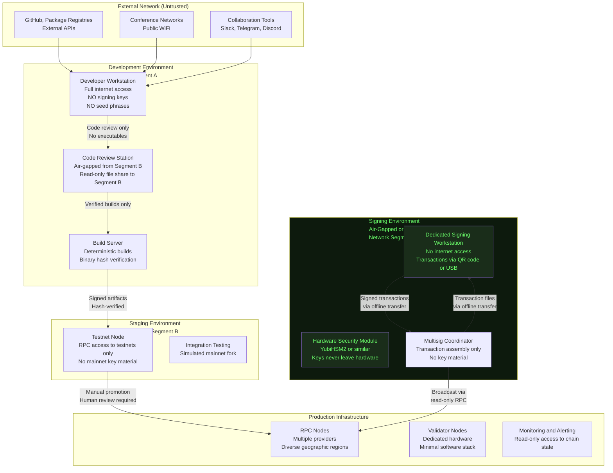
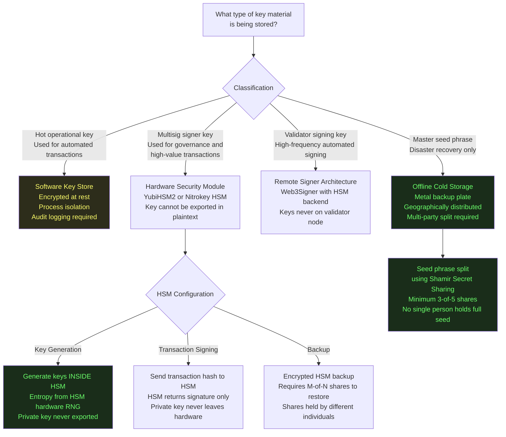

# Operating System Security for Web3 Infrastructure Operators

**Path:** `github.com/safeedges/infrasecurity/os-security/`  
**Document Version:** 1.8  
**Classification:** Public Reference Architecture  
**Applies To:** Validator operators, RPC node operators, developer machines handling signing keys, multisig signer devices  

---

## Threat Model

The OS-level threat model for Web3 infrastructure operators differs significantly from conventional enterprise IT. The specific threats observed in 2026 that motivate this document:

1. **Developer machine compromise via IDE vulnerabilities (Drift):** A known VSCode and Cursor vulnerability during December 2025 through February 2026 allowed silent code execution when certain files were opened. Attackers delivered malicious repositories through trusted social engineering channels.

2. **Supply chain malware via trusted applications (Drift):** TestFlight applications presented as legitimate wallet products were used to compromise contributor devices.

3. **RPC node binary replacement (KelpDAO):** Attackers with access to hosting infrastructure overwrote legitimate node binaries with malicious applications that selectively reported false data.

4. **Long-dwell persistence:** Lazarus Group operations maintain access for months before executing. Standard intrusion detection focused on rapid exfiltration may not detect a patient adversary who is quietly reading signing key material.

Under this threat model, the following OS-level controls are necessary:

1. Complete separation between developer environments and signing environments
2. Full disk encryption with hardware-backed key storage
3. File integrity monitoring for all critical binaries
4. Application allowlisting to prevent execution of unauthorized code
5. Network segmentation that isolates signing infrastructure from development infrastructure
6. Comprehensive audit logging with tamper-evident log forwarding
7. Hardened update and package management procedures

---

## System Architecture: Environment Separation

The single most important architectural decision for Web3 operator OS security is the complete separation of environments by trust level and function.



---

## Linux Hardening (Ubuntu 22.04 LTS / 24.04 LTS)

### Initial System Hardening Script

The following script documents the essential hardening steps for a fresh Linux installation used as a Web3 node or infrastructure server. Run as root on a freshly installed system before connecting to any network.

```bash
#!/bin/bash
# 
# safeedges-linux-hardening.sh
#
# Version: 2.1
# Purpose: Baseline hardening for Web3 infrastructure nodes
#          running Ubuntu 22.04 LTS or 24.04 LTS
#
# IMPORTANT: This script must be reviewed and adapted for your specific
# environment before execution. Do not run untested scripts as root on
# production infrastructure.
#
# Run order: Execute this script BEFORE enabling network access on
# a fresh installation. Many of these controls are more effective when
# applied before the system is exposed to the network.
#
# Tested on: Ubuntu 22.04 LTS, Ubuntu 24.04 LTS

set -euo pipefail

LOG_FILE="/var/log/hardening-$(date +%Y%m%d-%H%M%S).log"
exec > >(tee -a "$LOG_FILE") 2>&1

echo "=== SafeEdges Linux Hardening Script ==="
echo "Start time: $(date)"
echo "Hostname: $(hostname)"
echo "OS: $(lsb_release -d | cut -f2)"
echo ""

# -------------------------------------------------------------------
# SECTION 1: System Updates and Package Minimization
# -------------------------------------------------------------------
echo "[SECTION 1] System Updates and Package Minimization"

apt-get update -q
apt-get upgrade -y -q
apt-get dist-upgrade -y -q

# Remove unnecessary packages that expand the attack surface
apt-get remove -y \
    telnet \
    rsh-client \
    rsh-redone-client \
    nis \
    talk \
    talkd \
    xinetd \
    apport \
    whoopsie \
    avahi-daemon \
    cups \
    cups-daemon \
    2>/dev/null || true

apt-get autoremove -y -q
apt-get autoclean -q

# Enable automatic security updates only
# Prevents missed patches while keeping manual control of feature updates
cat > /etc/apt/apt.conf.d/50unattended-upgrades << 'EOF'
Unattended-Upgrade::Allowed-Origins {
    "${distro_id}:${distro_codename}-security";
};
Unattended-Upgrade::AutoFixInterruptedDpkg "true";
Unattended-Upgrade::MinimalSteps "true";
Unattended-Upgrade::Remove-Unused-Kernel-Packages "true";
Unattended-Upgrade::Remove-Unused-Dependencies "true";
Unattended-Upgrade::Automatic-Reboot "false";
Unattended-Upgrade::Mail "security-alerts@your-domain.com";
EOF

# -------------------------------------------------------------------
# SECTION 2: Kernel Hardening via sysctl
# -------------------------------------------------------------------
echo "[SECTION 2] Kernel Hardening"

cat > /etc/sysctl.d/99-safeedges-hardening.conf << 'EOF'
# Network hardening
# Disable IP forwarding (enable only on nodes that need to route traffic)
net.ipv4.ip_forward = 0
net.ipv6.conf.all.forwarding = 0

# Disable packet redirect sending
net.ipv4.conf.all.send_redirects = 0
net.ipv4.conf.default.send_redirects = 0

# Disable ICMP redirects
net.ipv4.conf.all.accept_redirects = 0
net.ipv4.conf.default.accept_redirects = 0
net.ipv6.conf.all.accept_redirects = 0
net.ipv6.conf.default.accept_redirects = 0

# Enable source route verification (prevents IP spoofing)
net.ipv4.conf.all.rp_filter = 1
net.ipv4.conf.default.rp_filter = 1

# Disable source routing
net.ipv4.conf.all.accept_source_route = 0
net.ipv4.conf.default.accept_source_route = 0

# Enable SYN flood protection
net.ipv4.tcp_syncookies = 1

# Ignore ICMP broadcast requests
net.ipv4.icmp_echo_ignore_broadcasts = 1

# Ignore bogus ICMP error responses
net.ipv4.icmp_ignore_bogus_error_responses = 1

# Kernel exploit mitigations
# Restrict /proc visibility between users
kernel.hidepid = 2

# Restrict kernel log access to root
kernel.dmesg_restrict = 1

# Restrict kernel pointer exposure via /proc
kernel.kptr_restrict = 2

# Randomize kernel address space layout
kernel.randomize_va_space = 2

# Disable magic SysRq key in production
kernel.sysrq = 0

# Restrict ptrace to direct parent process only
# This prevents debugger injection attacks
kernel.yama.ptrace_scope = 1

# Disable core dumps for setuid programs
fs.suid_dumpable = 0

# Increase inotify limits for monitoring tools
fs.inotify.max_user_watches = 524288
EOF

sysctl -p /etc/sysctl.d/99-safeedges-hardening.conf

# -------------------------------------------------------------------
# SECTION 3: SSH Hardening
# -------------------------------------------------------------------
echo "[SECTION 3] SSH Hardening"

# Backup original config
cp /etc/ssh/sshd_config /etc/ssh/sshd_config.backup.$(date +%Y%m%d)

cat > /etc/ssh/sshd_config.d/99-safeedges.conf << 'EOF'
# Use a non-standard port to reduce automated scan noise
# Change 2222 to your chosen non-standard port
Port 2222

# Only allow IPv4 (change to any if IPv6 is needed)
AddressFamily inet

# Disable root login entirely
PermitRootLogin no

# Require public key authentication only
PubkeyAuthentication yes
PasswordAuthentication no
PermitEmptyPasswords no
ChallengeResponseAuthentication no
KbdInteractiveAuthentication no

# Disable legacy authentication methods
HostbasedAuthentication no
IgnoreUserKnownHosts yes
IgnoreRhosts yes

# Disable X11 forwarding (not needed on servers)
X11Forwarding no

# Disable TCP agent forwarding to prevent lateral movement
AllowAgentForwarding no
AllowTcpForwarding no

# Restrict to modern cryptographic algorithms
# These match Mozilla's Modern compatibility profile as of 2026
KexAlgorithms curve25519-sha256,curve25519-sha256@libssh.org
Ciphers chacha20-poly1305@openssh.com,aes256-gcm@openssh.com,aes128-gcm@openssh.com
MACs hmac-sha2-512-etm@openssh.com,hmac-sha2-256-etm@openssh.com

# Disconnect idle sessions after 5 minutes
ClientAliveInterval 300
ClientAliveCountMax 0

# Reduce login attempt window
LoginGraceTime 30

# Limit authentication attempts
MaxAuthTries 3
MaxSessions 4

# Log all authentication events including public key auth
LogLevel VERBOSE

# Strict mode: enforce key file permissions
StrictModes yes

# Show last login information
PrintLastLog yes

# Explicitly list allowed users (replace with actual user list)
# AllowUsers nodeoperator adminuser
EOF

# Validate SSH configuration before restarting
sshd -t
systemctl restart sshd
echo "SSH hardening complete"

# -------------------------------------------------------------------
# SECTION 4: Firewall Configuration
# -------------------------------------------------------------------
echo "[SECTION 4] Firewall Configuration (UFW)"

apt-get install -y ufw

# Default: deny all incoming, allow all outgoing
ufw default deny incoming
ufw default allow outgoing
ufw default deny forward

# Allow SSH on non-standard port (change 2222 to your actual port)
ufw allow 2222/tcp comment 'SSH'

# Allow node-specific ports here (example: Ethereum P2P)
# ufw allow 30303/tcp comment 'Ethereum P2P'
# ufw allow 30303/udp comment 'Ethereum P2P discovery'

# Enable rate limiting on SSH to prevent brute force
ufw limit 2222/tcp

ufw --force enable
ufw status verbose

# -------------------------------------------------------------------
# SECTION 5: File Integrity Monitoring (AIDE)
# -------------------------------------------------------------------
echo "[SECTION 5] File Integrity Monitoring"

apt-get install -y aide aide-common

# Configure AIDE to monitor critical directories
cat > /etc/aide/aide.conf.d/99-safeedges.conf << 'EOF'
# Monitor critical system binaries for any modification
# This would have detected the binary replacement in the KelpDAO RPC attack
/usr/bin NORMAL+sha512
/usr/sbin NORMAL+sha512
/bin NORMAL+sha512
/sbin NORMAL+sha512
/lib NORMAL+sha512
/lib64 NORMAL+sha512

# Monitor node-specific binaries (add your actual paths)
# /opt/geth NORMAL+sha512
# /opt/lighthouse NORMAL+sha512
# /opt/prysm NORMAL+sha512

# Monitor system configuration
/etc NORMAL+sha512

# Monitor SSH keys and authorized_keys
/home PERMS+sha512
/root PERMS+sha512

# Exclude frequently changing files to reduce false positives
!/var/log
!/var/run
!/proc
!/sys
!/dev
EOF

# Initialize the AIDE database from current clean state
# This must be done on a known-good system
aide --config=/etc/aide/aide.conf --init
mv /var/lib/aide/aide.db.new /var/lib/aide/aide.db

# Schedule daily integrity checks
cat > /etc/cron.d/aide-check << 'EOF'
# Run AIDE integrity check daily at 3:00 AM
# Output is emailed to root (configure mail relay separately)
0 3 * * * root /usr/bin/aide --config=/etc/aide/aide.conf --check 2>&1 | mail -s "AIDE Integrity Report $(hostname) $(date)" security-alerts@your-domain.com
EOF

echo "AIDE file integrity monitoring configured"

# -------------------------------------------------------------------
# SECTION 6: Audit Logging
# -------------------------------------------------------------------
echo "[SECTION 6] Audit Logging Configuration"

apt-get install -y auditd audispd-plugins

cat > /etc/audit/rules.d/99-safeedges.rules << 'EOF'
# Auditd rules for Web3 node operator hardening
# Version: 2.1

# Delete existing rules and start fresh
-D

# Set buffer size (increase if audit events are being dropped)
-b 8192

# Failure mode: 1 = print failure, 2 = panic on failure
-f 1

# Monitor changes to critical system files
-w /etc/passwd -p wa -k identity
-w /etc/group -p wa -k identity
-w /etc/shadow -p wa -k identity
-w /etc/sudoers -p wa -k privilege_escalation
-w /etc/sudoers.d/ -p wa -k privilege_escalation

# Monitor SSH configuration changes
-w /etc/ssh/sshd_config -p wa -k sshd_config
-w /etc/ssh/sshd_config.d/ -p wa -k sshd_config

# Monitor cron jobs (persistence mechanism)
-w /etc/cron.d/ -p wa -k cron
-w /etc/cron.daily/ -p wa -k cron
-w /var/spool/cron/ -p wa -k cron

# Monitor for privilege escalation via setuid/setgid
-a always,exit -F arch=b64 -S setuid -F a0=0 -F exe=/usr/bin/su -k privilege_escalation
-a always,exit -F arch=b64 -S setresuid -F a0=0 -F exe=/usr/bin/sudo -k privilege_escalation

# Monitor for binary execution from unusual locations
# This would flag execution of a replaced node binary
-a always,exit -F arch=b64 -S execve -F dir=/tmp -k suspicious_execution
-a always,exit -F arch=b64 -S execve -F dir=/dev/shm -k suspicious_execution

# Monitor network configuration changes
-a always,exit -F arch=b64 -S sethostname -S setdomainname -k network_modification
-w /etc/network/ -p wa -k network_modification
-w /etc/hosts -p wa -k network_modification

# Monitor for loading of kernel modules (rootkit installation vector)
-w /sbin/insmod -p x -k kernel_module
-w /sbin/rmmod -p x -k kernel_module
-w /sbin/modprobe -p x -k kernel_module
-a always,exit -F arch=b64 -S init_module -S delete_module -k kernel_module

# Monitor mount operations
-a always,exit -F arch=b64 -S mount -k mount_operations

# Make rules immutable until next reboot (prevents an attacker from
# disabling audit logging once they have root access)
-e 2
EOF

service auditd restart
echo "Audit logging configured"

echo ""
echo "=== Hardening Script Complete ==="
echo "End time: $(date)"
echo "Review $LOG_FILE for complete output"
echo ""
echo "NEXT STEPS:"
echo "1. Review and customize SSH AllowUsers directive"
echo "2. Configure log forwarding to centralized SIEM"
echo "3. Initialize AIDE database on verified clean system"
echo "4. Test all configurations before applying to production"
```

---

## macOS Hardening for Signing Workstations

Developer machines used by multisig signers require additional macOS-specific hardening. The following documents the key controls.

```bash
#!/bin/bash
#
# safeedges-macos-hardening.sh
#
# Version: 1.3
# Purpose: macOS hardening for signing workstations
# Tested on: macOS 15 Sequoia
#
# Run as the signing workstation's primary user account.
# Some commands require sudo.

set -euo pipefail

echo "=== SafeEdges macOS Signing Workstation Hardening ==="
echo "System: $(sw_vers -productName) $(sw_vers -productVersion)"
echo ""

# -------------------------------------------------------------------
# SECTION 1: System Integrity Protection Verification
# -------------------------------------------------------------------
echo "[1] Verifying System Integrity Protection"
sip_status=$(csrutil status)
echo "SIP Status: $sip_status"
if [[ "$sip_status" != *"enabled"* ]]; then
    echo "CRITICAL: System Integrity Protection is DISABLED"
    echo "Enable SIP immediately. Boot to Recovery Mode and run: csrutil enable"
    exit 1
fi

# -------------------------------------------------------------------
# SECTION 2: Firewall Configuration
# -------------------------------------------------------------------
echo "[2] Configuring Application Firewall"

# Enable the macOS Application Firewall
sudo /usr/libexec/ApplicationFirewall/socketfilterfw --setglobalstate on

# Enable stealth mode (do not respond to ICMP ping or port scans)
sudo /usr/libexec/ApplicationFirewall/socketfilterfw --setstealthmode on

# Block all incoming connections by default
sudo /usr/libexec/ApplicationFirewall/socketfilterfw --setblockall on

echo "Firewall configured"

# -------------------------------------------------------------------
# SECTION 3: Gatekeeper and XProtect
# -------------------------------------------------------------------
echo "[3] Verifying Gatekeeper"
gatekeeper_status=$(spctl --status)
echo "Gatekeeper: $gatekeeper_status"
if [[ "$gatekeeper_status" != "assessments enabled" ]]; then
    sudo spctl --master-enable
    echo "Gatekeeper enabled"
fi

# -------------------------------------------------------------------
# SECTION 4: File Sharing and Remote Access Disablement
# -------------------------------------------------------------------
echo "[4] Disabling Unnecessary Services"

# Disable file sharing
sudo launchctl unload -w /System/Library/LaunchDaemons/com.apple.smbd.plist 2>/dev/null || true
sudo launchctl unload -w /System/Library/LaunchDaemons/com.apple.AppleFileServer.plist 2>/dev/null || true

# Disable remote login (SSH)
sudo systemsetup -setremotelogin off 2>/dev/null || true

# Disable remote management
sudo /System/Library/CoreServices/RemoteManagement/ARDAgent.app/Contents/Resources/kickstart -deactivate -stop 2>/dev/null || true

# Disable Bluetooth if not required
# sudo defaults write /Library/Preferences/com.apple.Bluetooth ControllerPowerState -int 0

echo "Remote services disabled"

# -------------------------------------------------------------------
# SECTION 5: Full Disk Encryption Verification
# -------------------------------------------------------------------
echo "[5] Verifying FileVault Status"
filevault_status=$(fdesetup status)
echo "FileVault: $filevault_status"
if [[ "$filevault_status" != "FileVault is On." ]]; then
    echo "WARNING: FileVault is not enabled. Enable via System Preferences > Security & Privacy."
fi

# -------------------------------------------------------------------
# SECTION 6: Disable IDE Auto-Execution Features
# -------------------------------------------------------------------
echo "[6] Hardening IDE Configuration"

# This directly addresses the VSCode/Cursor vulnerability used in the Drift attack
# which silently executed code when files were opened

# Disable workspace trust bypass in VSCode
VSCODE_SETTINGS="$HOME/Library/Application Support/Code/User/settings.json"
if [ -f "$VSCODE_SETTINGS" ]; then
    echo "VSCode settings found. Ensure workspace trust is not bypassed."
    echo "Required settings:"
    echo '  "security.workspace.trust.enabled": true'
    echo '  "security.workspace.trust.startupPrompt": "always"'
    echo '  "extensions.autoUpdate": false'
fi

# Signing workstations should NOT have VSCode, Cursor, or other IDEs installed
# The signing workstation is a purpose-built device for transaction signing ONLY
echo ""
echo "NOTE: Signing workstations should NOT have development IDEs installed."
echo "Separate developer machines from signing machines completely."

echo ""
echo "=== macOS Hardening Complete ==="
```

---

## Key Management Architecture

The most critical security control for multisig signers is the physical separation between key material and networked systems. The KelpDAO and Drift incidents both involve attackers who may have had access to developer machines that held key material in software wallets or browser extensions.

### Key Storage Decision Tree



### Shamir Secret Sharing for Seed Backup

```python
#!/usr/bin/env python3
"""
shamir_seed_backup.py

Demonstrates Shamir Secret Sharing for distributing a BIP39 seed phrase
backup across multiple parties such that any M-of-N parties must cooperate
to reconstruct the seed.

This is a CONCEPTUAL DEMONSTRATION using the shamir-mnemonic library.
In production, use: pip install shamir-mnemonic

Security properties:
1. Any M shares reconstruct the secret
2. Any M-1 shares reveal NOTHING about the secret (information-theoretically)
3. Different share holders never need to be in the same room

Distribution model for a 3-of-5 split:
  Share 1: Signer A (carries personally)
  Share 2: Signer B (carries personally)
  Share 3: Signer C (carries personally)
  Share 4: Cold storage in location X
  Share 5: Cold storage in location Y (different jurisdiction)

Reconstruction requires 3 of 5 cooperating parties.
Loss of 2 shares still permits recovery.
Compromise of 2 shares reveals nothing about the seed.
"""

from shamir_mnemonic import generate_mnemonics, combine_mnemonics


def split_seed_to_shares(
    seed_bytes: bytes,
    master_secret_threshold: int,
    share_count: int,
    passphrase: bytes = b""
) -> list[list[str]]:
    """
    Split seed bytes into Shamir shares.
    
    Args:
        seed_bytes: The secret to split (e.g., 32 bytes of entropy)
        master_secret_threshold: Minimum shares required to reconstruct
        share_count: Total number of shares to generate
        passphrase: Optional passphrase to further protect the shares
    
    Returns:
        List of shares, each represented as a list of mnemonic words
    """
    
    if master_secret_threshold > share_count:
        raise ValueError("Threshold cannot exceed share count")
    
    if len(seed_bytes) not in [16, 32]:
        raise ValueError("Seed must be 16 or 32 bytes")
    
    # Each share group contains one share
    # This creates a flat M-of-N scheme
    share_groups = [(master_secret_threshold, share_count)]
    
    mnemonics = generate_mnemonics(
        group_threshold=1,
        groups=share_groups,
        master_secret=seed_bytes,
        passphrase=passphrase,
        iteration_exponent=1
    )
    
    # Return the first (and only) group's shares
    return mnemonics[0]


def reconstruct_seed_from_shares(
    shares: list[list[str]],
    passphrase: bytes = b""
) -> bytes:
    """
    Reconstruct the seed from a threshold number of shares.
    
    Requires at least M shares where M was the threshold at creation time.
    Providing more than M shares is acceptable and does not change the result.
    """
    return combine_mnemonics(shares, passphrase=passphrase)


# Example usage (do NOT use random.urandom in production - use
# a cryptographically vetted entropy source or generate within HSM)
if __name__ == "__main__":
    import os
    
    # Generate 32 bytes of entropy
    secret = os.urandom(32)
    
    # Split: 3-of-5 threshold
    shares = split_seed_to_shares(
        seed_bytes=secret,
        master_secret_threshold=3,
        share_count=5
    )
    
    print(f"Generated {len(shares)} shares")
    print("Share distribution:")
    for i, share in enumerate(shares):
        print(f"  Share {i+1}: {' '.join(share[:4])}... ({len(share)} words)")
    
    # Verify reconstruction with exactly 3 shares
    recovered = reconstruct_seed_from_shares(shares[:3])
    assert recovered == secret, "Reconstruction failed"
    print("Reconstruction with 3-of-5 shares: VERIFIED")
```

---

## OS Security Checklist

**Physical Security**  
1. Signing workstations are physically secured in locked facilities  
2. Full disk encryption (LUKS on Linux, FileVault on macOS) is enabled on all systems  
3. Secure boot is enabled and firmware passwords are set  
4. USB ports are physically disabled or policy-controlled on signing machines  

**System Hardening**  
5. All unnecessary packages and services are removed  
6. sysctl kernel hardening parameters are applied and persistent  
7. SSH is configured to key-based authentication only with modern cipher suites  
8. All administrative commands require sudo with audit logging  
9. Firewall is enabled with default-deny inbound policy  

**Integrity Monitoring**  
10. AIDE or equivalent file integrity monitoring is deployed on all nodes  
11. Baseline was taken on a verified clean system and stored offline  
12. Integrity checks run daily with alerts on any modification  
13. Node process binaries are checked against expected hashes after every update  

**Audit Logging**  
14. auditd is deployed with rules covering privilege escalation, binary execution, and configuration changes  
15. Logs are forwarded in real time to a centralized, tamper-evident log aggregator  
16. Log forwarding cannot be interrupted by a compromised local system  

**Key Management**  
17. Multisig signing keys are stored in hardware security modules exclusively  
18. Signing workstations have no internet access  
19. Transaction signing uses QR code or offline USB transfer, never direct network connection  
20. Seed phrases are split using Shamir Secret Sharing with minimum 3-of-5 distribution  
21. No single individual holds a complete seed phrase or sufficient shares to reconstruct one  

**Developer Machine Security**  
22. Developer machines are completely separated from signing machines at the network and physical level  
23. IDE automatic execution features are disabled  
24. All IDE extensions are reviewed and approved before installation  
25. Cloning external repositories is done in an isolated container or VM before any code is executed  
26. TestFlight and other beta software is prohibited on machines connected to production infrastructure  
