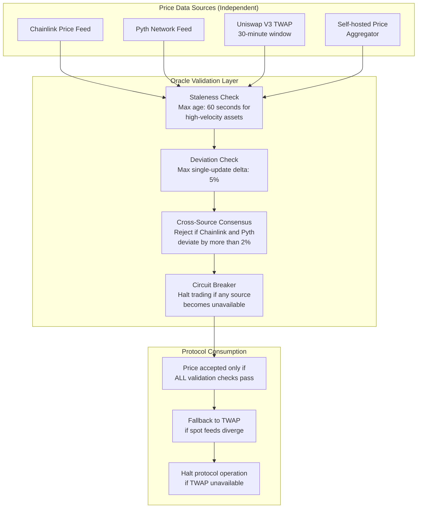
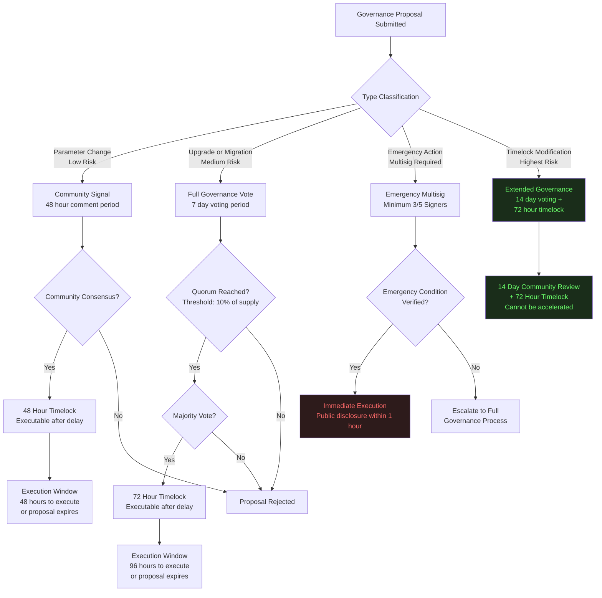

# Protocol Security

**Path:** `github.com/safeedges/infrasecurity/protocol-security/`  
**Document Version:** 2.1  
**Classification:** Public Reference Architecture  
**Domain Coverage:** Smart Contract Security, Bridge Architecture, Oracle Design, Governance Security, Cross-Chain Trust Models  

---

## Threat Model

A Web3 protocol's threat model must account for adversaries ranging from opportunistic script kiddies to nation-state-backed teams with months of operational runway, real capital, and sophisticated social engineering capability. The threat model used in this document reflects the actual capabilities demonstrated by DPRK-affiliated actors in 2026:

1. Patient adversaries with 6-month or longer preparation timelines
2. Teams capable of simultaneously compromising infrastructure and launching DDoS attacks
3. Actors who will build genuine professional relationships and deposit real capital to establish trust
4. Groups that study protocol documentation, governance structures, and upgrade mechanisms thoroughly before executing
5. Nation-state-affiliated teams with unlimited operational budget relative to most DeFi protocol security budgets

Under this threat model, the following attack surfaces require explicit attention:

1. Smart contract logic and arithmetic
2. Cross-chain bridge trust assumptions
3. Oracle data integrity
4. Governance and access control mechanisms
5. Key management and signing infrastructure
6. Off-chain infrastructure dependencies (RPC nodes, relayers, DVNs)
7. Protocol upgrade and migration mechanisms
8. Developer toolchain and supply chain

---

## Smart Contract Security

### Fundamental Invariants

Every smart contract protocol must define and enforce a set of invariants that represent states the protocol should never enter under any circumstances. These invariants are the most important documentation a protocol can maintain, more important than code comments, because they define the security boundary.

For a liquid staking or restaking protocol like KelpDAO, the fundamental invariant is:

```
Total circulating supply of liquid token across all chains = 
Total underlying asset held in deposit contracts across all chains
```

For a lending protocol like Aave, a critical invariant is:

```
For every outstanding borrow position:
    Collateral value * liquidation threshold > Borrow value
```

These invariants must be enforced not just by smart contract logic but by independent off-chain monitoring that alerts when any invariant is violated, even temporarily.

### Invariant Checking Code Pattern

```solidity
// SPDX-License-Identifier: MIT
pragma solidity ^0.8.20;

/**
 * InvariantChecker.sol
 * 
 * Purpose: Demonstrate pattern for cross-chain supply invariant monitoring.
 * This pattern should be deployed as an independent monitoring contract,
 * not bundled with the protocol itself, to ensure the checker cannot be
 * influenced by an attacker who has already compromised the protocol.
 *
 * Security Property: Total minted supply on destination chain should never
 * exceed total locked supply on source chain as reported by canonical oracle.
 */

interface ISupplyOracle {
    function getTotalLockedSupply() external view returns (uint256);
}

interface IERC20 {
    function totalSupply() external view returns (uint256);
}

contract CrossChainSupplyInvariantChecker {
    
    address public immutable liquidToken;
    address public immutable lockedSupplyOracle;
    address public immutable pauseMultisig;
    
    uint256 public constant MAX_DEVIATION_BPS = 50; // 0.5% tolerance for rounding
    uint256 public constant ALERT_COOLDOWN = 300;   // 5 minutes between repeated alerts
    
    uint256 public lastAlertTimestamp;
    bool public invariantViolationActive;
    
    event InvariantViolation(
        uint256 circulatingSupply,
        uint256 lockedSupply,
        uint256 excessMinted,
        uint256 timestamp
    );
    
    event InvariantRestored(uint256 timestamp);
    
    constructor(
        address _liquidToken,
        address _lockedSupplyOracle,
        address _pauseMultisig
    ) {
        liquidToken = _liquidToken;
        lockedSupplyOracle = _lockedSupplyOracle;
        pauseMultisig = _pauseMultisig;
    }
    
    /**
     * checkInvariant()
     * 
     * Called by automated monitoring bots at every block or on a
     * configurable heartbeat. Anyone can call this function.
     * 
     * If violation is detected:
     * 1. Emits InvariantViolation event (picked up by alert infrastructure)
     * 2. Sets invariantViolationActive flag (visible to other contracts)
     * 3. In production integration: calls emergency pause on protocol
     */
    function checkInvariant() external returns (bool isHealthy) {
        uint256 circulatingSupply = IERC20(liquidToken).totalSupply();
        uint256 lockedSupply = ISupplyOracle(lockedSupplyOracle).getTotalLockedSupply();
        
        // Allow small deviation for rounding and in-flight transactions
        uint256 toleranceAmount = (lockedSupply * MAX_DEVIATION_BPS) / 10000;
        
        if (circulatingSupply > lockedSupply + toleranceAmount) {
            uint256 excess = circulatingSupply - lockedSupply;
            
            if (!invariantViolationActive) {
                invariantViolationActive = true;
            }
            
            if (block.timestamp >= lastAlertTimestamp + ALERT_COOLDOWN) {
                lastAlertTimestamp = block.timestamp;
                emit InvariantViolation(
                    circulatingSupply,
                    lockedSupply,
                    excess,
                    block.timestamp
                );
                
                // In production: trigger automated pause
                // IPausable(protocolAddress).emergencyPause();
            }
            
            return false;
        }
        
        if (invariantViolationActive) {
            invariantViolationActive = false;
            emit InvariantRestored(block.timestamp);
        }
        
        return true;
    }
}
```

### Reentrancy Protection

The standard reentrancy patterns remain relevant. The following demonstrates the checks-effects-interactions pattern alongside OpenZeppelin's ReentrancyGuard:

```solidity
// SPDX-License-Identifier: MIT
pragma solidity ^0.8.20;

import "@openzeppelin/contracts/utils/ReentrancyGuard.sol";

/**
 * SecureWithdrawal.sol
 *
 * Demonstrates the checks-effects-interactions pattern combined with
 * reentrancy guard. The order of operations is critical:
 * 1. CHECK all conditions first (revert early if invalid)
 * 2. EFFECT all state changes before any external calls
 * 3. INTERACT with external contracts only after all state is settled
 *
 * Both protections are used defensively. Do not rely on only one.
 */
contract SecureWithdrawal is ReentrancyGuard {
    
    mapping(address => uint256) public balances;
    
    event Withdrawal(address indexed user, uint256 amount);
    
    function deposit() external payable {
        balances[msg.sender] += msg.value;
    }
    
    function withdraw(uint256 amount) external nonReentrant {
        // CHECKS: Verify preconditions before any state change
        require(amount > 0, "Amount must be positive");
        require(balances[msg.sender] >= amount, "Insufficient balance");
        
        // EFFECTS: Update state before any external interaction
        // If the external call reverts or reenters, state is already settled
        balances[msg.sender] -= amount;
        
        emit Withdrawal(msg.sender, amount);
        
        // INTERACTIONS: Only after all state changes are complete
        (bool success, ) = msg.sender.call{value: amount}("");
        require(success, "Transfer failed");
    }
}
```

---

## Cross-Chain Bridge Security

The KelpDAO incident is the definitive case study for cross-chain bridge security failures. The attack succeeded not because of a smart contract bug but because the entire verification trust chain was poisoned.

### Bridge Security Architecture

A secure cross-chain bridge must satisfy the following security properties:

1. **Verification Independence:** Multiple verifiers must operate on independent infrastructure with no shared single points of failure in hardware, hosting provider, software stack, or key management.
2. **Quorum Requirement:** No single verifier compromise should be sufficient to authorize a cross-chain message. A minimum of 2-of-3 independent verifiers should be required.
3. **Source Diversity:** Each verifier must maintain connections to multiple independent RPC providers. The compromise of any single RPC provider should not affect the verifier's ability to reach consensus on chain state.
4. **Supply Consistency Monitoring:** An independent system must continuously verify that the total supply of any bridged token across all chains equals the locked supply on the canonical source chain.
5. **Automated Circuit Breakers:** Any single-block minting event exceeding a configurable threshold must trigger an automatic pause pending human review.

### Secure DVN Configuration (LayerZero Pattern)

```typescript
/**
 * secureDVNConfig.ts
 *
 * Reference configuration for LayerZero OApp with hardened DVN setup.
 * This configuration demonstrates the multi-DVN model that would have
 * prevented the KelpDAO exploit.
 *
 * The 1-of-1 configuration used by KelpDAO meant that compromising
 * a single DVN's RPC data source was sufficient to forge cross-chain messages.
 *
 * This 2-of-3 configuration requires an attacker to simultaneously
 * compromise two independent DVNs with independent infrastructure.
 */

import { EndpointId } from "@layerzerolabs/lz-definitions";
import { OmniEdgeHardhat } from "@layerzerolabs/toolbox-hardhat";

export const dvnConfig: OmniEdgeHardhat = {
    // Required DVNs: ALL of these must verify the message
    // Minimum secure configuration is 2 required DVNs
    requiredDVNs: [
        "0xDVN_PROVIDER_A_ADDRESS",  // Provider A: independent org, geographic region A
        "0xDVN_PROVIDER_B_ADDRESS",  // Provider B: independent org, geographic region B
    ],
    
    // Optional DVNs: These provide additional verification signal
    // but are not required for message acceptance
    optionalDVNs: [
        "0xDVN_PROVIDER_C_ADDRESS",  // Provider C: independent org, geographic region C
    ],
    
    // Threshold: minimum optional DVNs that must verify
    // Combined with requiredDVNs, this creates a 3-of-3 effective quorum
    // when all optional DVNs are responsive
    optionalDVNThreshold: 1,
    
    // Block confirmations before message is considered final
    // Higher values increase security at cost of latency
    confirmations: BigInt(12),
};

/**
 * DVN Provider Selection Criteria
 *
 * Each required DVN provider must satisfy ALL of the following:
 *
 * 1. Organizational independence: Different legal entity, different team, 
 *    different incentive structure from other required DVNs
 * 2. Infrastructure independence: Different cloud provider or bare metal,
 *    different geographic region, different internet exchange point
 * 3. RPC source diversity: Each DVN must query at least 3 independent
 *    RPC providers (e.g., Infura + Alchemy + self-hosted full node)
 * 4. Majority RPC consensus: DVN should accept a cross-chain event only
 *    if a majority of its RPC sources agree (e.g., 2-of-3)
 * 5. Slashing mechanism: DVN must have economic stake at risk for
 *    malicious or negligent verification
 * 6. Public audit history: DVN operator's infrastructure should have
 *    undergone independent security audit within the last 12 months
 */

/**
 * mintingCircuitBreaker.ts
 *
 * Off-chain circuit breaker script that should run as a separate service,
 * independent from all bridge infrastructure.
 *
 * Monitors for anomalous minting events and triggers emergency pause
 * if a single minting event or a 60-second window of minting events
 * exceeds the defined threshold.
 */

async function monitorMintingEvents(
    provider: ethers.Provider,
    tokenContract: ethers.Contract,
    pauseContract: ethers.Contract,
    pauserSigner: ethers.Signer
) {
    const SINGLE_MINT_THRESHOLD = ethers.parseEther("1000");  // 1000 rsETH in single tx
    const WINDOW_MINT_THRESHOLD = ethers.parseEther("5000");  // 5000 rsETH in 60 seconds
    
    let windowMintTotal = BigInt(0);
    let windowStartTime = Date.now();
    
    tokenContract.on("Transfer", async (from, to, amount, event) => {
        // Only monitor mints (transfers from zero address)
        if (from !== ethers.ZeroAddress) return;
        
        const mintAmount = BigInt(amount);
        
        // Reset window if 60 seconds have elapsed
        if (Date.now() - windowStartTime > 60000) {
            windowMintTotal = BigInt(0);
            windowStartTime = Date.now();
        }
        
        windowMintTotal += mintAmount;
        
        const singleMintExceeded = mintAmount > SINGLE_MINT_THRESHOLD;
        const windowMintExceeded = windowMintTotal > WINDOW_MINT_THRESHOLD;
        
        if (singleMintExceeded || windowMintExceeded) {
            console.error(`CIRCUIT BREAKER TRIGGERED`);
            console.error(`Single mint amount: ${ethers.formatEther(mintAmount)} rsETH`);
            console.error(`60-second window total: ${ethers.formatEther(windowMintTotal)} rsETH`);
            console.error(`Block: ${event.blockNumber}, Tx: ${event.transactionHash}`);
            
            try {
                // Execute emergency pause
                const tx = await pauseContract.connect(pauserSigner).emergencyPause();
                console.error(`Emergency pause executed: ${tx.hash}`);
            } catch (err) {
                // Alert escalation: if pause fails, alert must go to human responders
                await sendEmergencyAlert({
                    severity: "CRITICAL",
                    message: "Circuit breaker triggered but automated pause failed",
                    details: { mintAmount: mintAmount.toString(), txHash: event.transactionHash }
                });
            }
        }
    });
}
```

---

## Oracle Security

Oracle manipulation is one of the oldest and most reliably exploited attack vectors in DeFi. The Drift Protocol attack used oracle manipulation as a secondary mechanism to inflate the value of CVT collateral.

### Oracle Security Architecture



### Secure Oracle Integration Pattern

```solidity
// SPDX-License-Identifier: MIT
pragma solidity ^0.8.20;

/**
 * SecureOracleAggregator.sol
 *
 * Demonstrates defense-in-depth oracle integration with:
 * 1. Staleness check: reject prices older than maxAge
 * 2. Sanity bounds: reject prices outside expected range
 * 3. Deviation check: reject single-update jumps exceeding threshold
 * 4. Multi-source consensus: require agreement between sources
 *
 * The Drift attack used a fake CVT token with oracle manipulation.
 * A protocol using this pattern would have rejected CVT as collateral
 * at the staleness or sanity bounds check since a new token with
 * no deep liquidity cannot satisfy these requirements for new listings.
 */

interface AggregatorV3Interface {
    function latestRoundData() external view returns (
        uint80 roundId,
        int256 answer,
        uint256 startedAt,
        uint256 updatedAt,
        uint80 answeredInRound
    );
}

contract SecureOracleAggregator {
    
    struct OracleConfig {
        address primaryFeed;      // Chainlink feed
        address secondaryFeed;    // Pyth or alternative feed
        uint256 maxAge;           // Maximum acceptable data age in seconds
        int256 minPrice;          // Sanity floor: reject below this
        int256 maxPrice;          // Sanity ceiling: reject above this
        uint256 maxDeviationBps;  // Max acceptable % divergence between sources
        uint256 minLiquidityUSD;  // Minimum liquidity required before oracle accepted
        bool requireBothSources;  // If true, both feeds must be available
    }
    
    mapping(address => OracleConfig) public oracleConfigs;
    mapping(address => int256) public lastAcceptedPrice;
    
    uint256 public constant MAX_SINGLE_UPDATE_BPS = 500; // 5% max single update
    
    event PriceAccepted(address indexed asset, int256 price, uint256 timestamp);
    event PriceRejected(address indexed asset, string reason, int256 reportedPrice);
    
    error StalePrice(address asset, uint256 updatedAt, uint256 maxAge);
    error PriceOutOfBounds(address asset, int256 price, int256 min, int256 max);
    error SourceDeviation(address asset, int256 primary, int256 secondary, uint256 deviationBps);
    error ExcessiveSingleUpdate(address asset, int256 lastPrice, int256 newPrice);
    error OracleNotConfigured(address asset);
    
    function getSecurePrice(address asset) external returns (int256 price) {
        OracleConfig memory config = oracleConfigs[asset];
        
        if (config.primaryFeed == address(0)) {
            revert OracleNotConfigured(asset);
        }
        
        // Fetch primary source
        (
            ,
            int256 primaryPrice,
            ,
            uint256 primaryUpdatedAt,
        ) = AggregatorV3Interface(config.primaryFeed).latestRoundData();
        
        // STALENESS CHECK: reject data older than maxAge
        if (block.timestamp - primaryUpdatedAt > config.maxAge) {
            revert StalePrice(asset, primaryUpdatedAt, config.maxAge);
        }
        
        // SANITY BOUNDS CHECK: reject prices outside expected operational range
        if (primaryPrice < config.minPrice || primaryPrice > config.maxPrice) {
            revert PriceOutOfBounds(asset, primaryPrice, config.minPrice, config.maxPrice);
        }
        
        // SINGLE-UPDATE DEVIATION CHECK: reject sudden large jumps
        if (lastAcceptedPrice[asset] != 0) {
            int256 last = lastAcceptedPrice[asset];
            int256 delta = primaryPrice > last 
                ? primaryPrice - last 
                : last - primaryPrice;
            uint256 deviationBps = uint256((delta * 10000) / last);
            
            if (deviationBps > MAX_SINGLE_UPDATE_BPS) {
                revert ExcessiveSingleUpdate(asset, last, primaryPrice);
            }
        }
        
        // CROSS-SOURCE CONSENSUS: check secondary feed agreement
        if (config.secondaryFeed != address(0)) {
            (
                ,
                int256 secondaryPrice,
                ,
                uint256 secondaryUpdatedAt,
            ) = AggregatorV3Interface(config.secondaryFeed).latestRoundData();
            
            if (block.timestamp - secondaryUpdatedAt > config.maxAge) {
                if (config.requireBothSources) {
                    revert StalePrice(asset, secondaryUpdatedAt, config.maxAge);
                }
                // If secondary is stale but not required, use primary only
                // but emit an alert-level event
                emit PriceRejected(asset, "Secondary feed stale, using primary only", secondaryPrice);
            } else {
                int256 delta = primaryPrice > secondaryPrice 
                    ? primaryPrice - secondaryPrice 
                    : secondaryPrice - primaryPrice;
                uint256 deviationBps = uint256((delta * 10000) / primaryPrice);
                
                if (deviationBps > config.maxDeviationBps) {
                    revert SourceDeviation(asset, primaryPrice, secondaryPrice, deviationBps);
                }
            }
        }
        
        lastAcceptedPrice[asset] = primaryPrice;
        emit PriceAccepted(asset, primaryPrice, block.timestamp);
        
        return primaryPrice;
    }
}
```

---

## Governance Security

The Drift Protocol attack exploited a governance structure that had been made dangerously permissive just days before the attack. Secure governance design is not optional; it is a core protocol security control.

### Governance Security Decision Flow



### Timelock Implementation

```solidity
// SPDX-License-Identifier: MIT
pragma solidity ^0.8.20;

/**
 * ProtocolTimelock.sol
 *
 * Minimal timelock implementation demonstrating the control that
 * was removed from Drift Protocol 5 days before the exploit.
 *
 * CRITICAL PROPERTY: The timelock itself must be immutable once deployed,
 * or changes to the timelock must require an even longer timelock period.
 * An attacker with governance access who can instantly reduce the timelock
 * to zero has effectively bypassed the entire control.
 *
 * The minimum delay should be set based on the protocol's response
 * capability. A team that monitors governance 24/7 may use 24 hours.
 * A team without continuous monitoring should use 72 hours minimum.
 */
contract ProtocolTimelock {
    
    uint256 public constant MINIMUM_DELAY = 48 hours;
    uint256 public constant MAXIMUM_DELAY = 30 days;
    
    // The delay itself can only be changed through the timelock process,
    // meaning a delay reduction requires the CURRENT delay to expire first.
    uint256 public delay;
    
    address public admin;
    address public pendingAdmin;
    
    mapping(bytes32 => bool) public queuedTransactions;
    
    event TransactionQueued(
        bytes32 indexed txHash,
        address indexed target,
        uint256 value,
        string signature,
        bytes data,
        uint256 eta
    );
    
    event TransactionExecuted(
        bytes32 indexed txHash,
        address indexed target,
        uint256 value,
        string signature,
        bytes data,
        uint256 eta
    );
    
    event TransactionCancelled(bytes32 indexed txHash);
    
    error InsufficientDelay(uint256 provided, uint256 required);
    error TransactionNotQueued(bytes32 txHash);
    error TimelockNotExpired(uint256 eta, uint256 current);
    error TimelockExpired(bytes32 txHash);
    error TransactionReverted(bytes32 txHash);
    
    modifier onlyAdmin() {
        require(msg.sender == admin, "Timelock: caller is not admin");
        _;
    }
    
    constructor(address _admin, uint256 _delay) {
        require(_delay >= MINIMUM_DELAY, "Timelock: delay below minimum");
        require(_delay <= MAXIMUM_DELAY, "Timelock: delay above maximum");
        admin = _admin;
        delay = _delay;
    }
    
    function queueTransaction(
        address target,
        uint256 value,
        string memory signature,
        bytes memory data,
        uint256 eta
    ) external onlyAdmin returns (bytes32) {
        
        if (eta < block.timestamp + delay) {
            revert InsufficientDelay(eta - block.timestamp, delay);
        }
        
        bytes32 txHash = keccak256(abi.encode(target, value, signature, data, eta));
        queuedTransactions[txHash] = true;
        
        emit TransactionQueued(txHash, target, value, signature, data, eta);
        return txHash;
    }
    
    function executeTransaction(
        address target,
        uint256 value,
        string memory signature,
        bytes memory data,
        uint256 eta
    ) external payable onlyAdmin returns (bytes memory) {
        
        bytes32 txHash = keccak256(abi.encode(target, value, signature, data, eta));
        
        if (!queuedTransactions[txHash]) revert TransactionNotQueued(txHash);
        if (block.timestamp < eta) revert TimelockNotExpired(eta, block.timestamp);
        if (block.timestamp > eta + 14 days) revert TimelockExpired(txHash);
        
        queuedTransactions[txHash] = false;
        
        bytes memory callData = bytes(signature).length == 0
            ? data
            : abi.encodePacked(bytes4(keccak256(bytes(signature))), data);
        
        (bool success, bytes memory returnData) = target.call{value: value}(callData);
        if (!success) revert TransactionReverted(txHash);
        
        emit TransactionExecuted(txHash, target, value, signature, data, eta);
        return returnData;
    }
    
    function cancelTransaction(
        address target,
        uint256 value,
        string memory signature,
        bytes memory data,
        uint256 eta
    ) external onlyAdmin {
        bytes32 txHash = keccak256(abi.encode(target, value, signature, data, eta));
        queuedTransactions[txHash] = false;
        emit TransactionCancelled(txHash);
    }
}
```

---

## Protocol Security Checklist

**Smart Contract Fundamentals**  
1. All critical invariants are documented and verified by at least two independent auditors  
2. Reentrancy guards are applied to all state-changing functions that make external calls  
3. Checks-effects-interactions pattern is enforced by code review policy  
4. Integer arithmetic uses SafeMath or Solidity 0.8.x checked arithmetic  
5. All external call return values are checked  
6. Flash loan attack vectors have been analyzed for all functions  
7. Front-running attack vectors have been analyzed for sensitive operations  
8. Upgrade mechanisms use a timelock with a minimum 48-hour delay  

**Bridge and Cross-Chain Security**  
9. DVN configuration requires minimum 2-of-3 independent verifiers  
10. Each DVN queries at minimum 3 independent RPC providers  
11. An independent cross-chain supply consistency monitor is deployed  
12. Automated circuit breakers halt minting above threshold within seconds  
13. Emergency pause can be triggered within 5 minutes of anomaly detection  

**Oracle Security**  
14. All price feeds have staleness checks with asset-appropriate max age  
15. All price feeds have sanity bound checks  
16. Single-update deviation thresholds are configured  
17. Multi-source consensus is required for all collateral pricing  
18. New token listings require minimum 30 days of price history before oracle acceptance  

**Governance Security**  
19. All administrative functions require a minimum 48-hour timelock  
20. Timelock duration can only be increased, never decreased  
21. Multisig threshold is a minimum of 3-of-5 or 4-of-7  
22. Multisig signers use hardware wallets exclusively  
23. Emergency actions require separate documentation and public disclosure within 1 hour  
24. Governance proposals are publicly visible during their full delay period  
